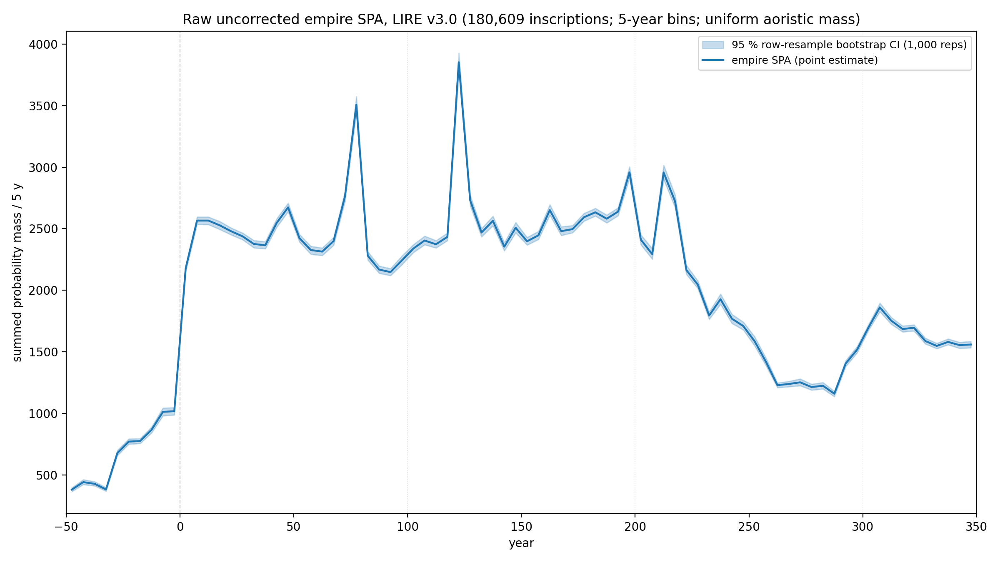
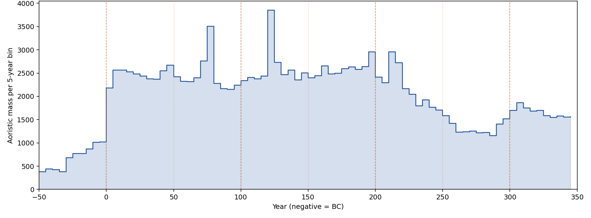
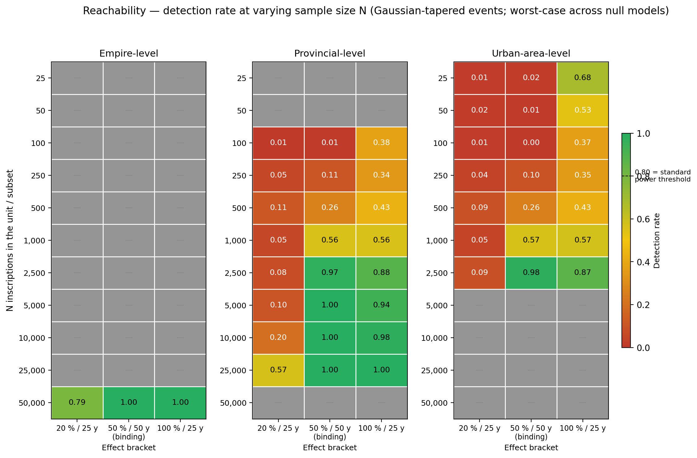
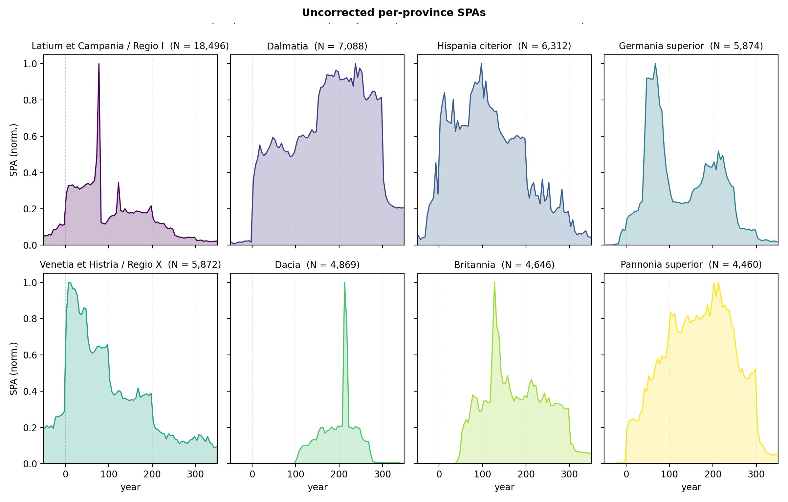
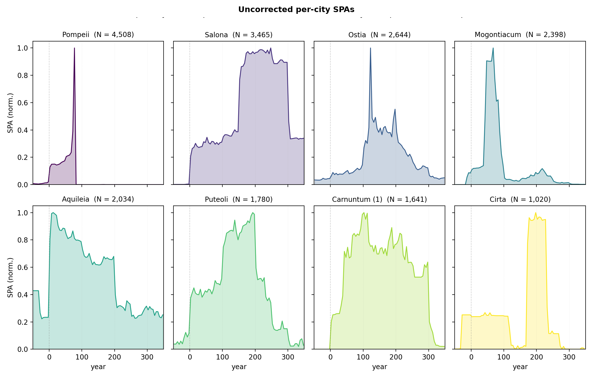
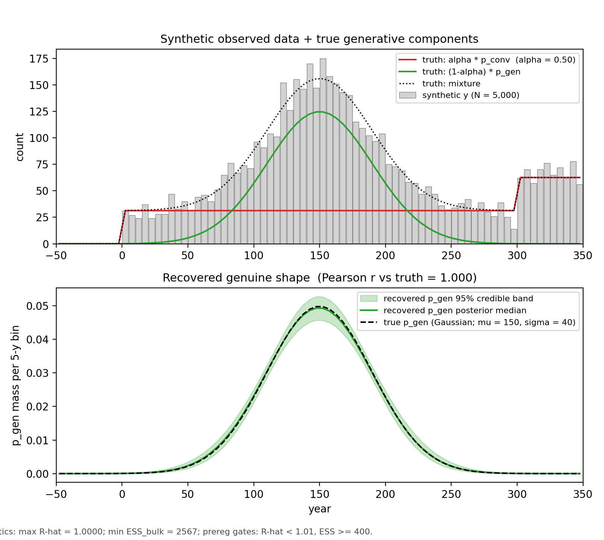

## 1 · Are inscriptions a demographic proxy?

::: {.columns}
::: {.column width="55%"}
Radiocarbon date SPA has been used as a demographic proxy in archaeology for 40 years.

Can Latin inscriptions be used the same way? (e.g., **LIRE v3.0 with 180,609 inscriptions**)

**The Objection**: Inscripton counts only reflect the *epigraphic habit*, not demography.

**Our question**: How much (if any) demographic signal is in the counts?
:::
::: {.column width="45%"}
{fig-align="center"}
:::
:::

::: notes
**Slide 1** (≈ 90 s)

- SPA tradition: Rick 1987 · Timpson 2014 · Crema & Bevan 2021
- LIRE v3.0: 180,609 inscriptions, Western Empire, 50 BC – AD 350 (Kaše 2023)
- Objection: MacMullen 1982 / Hanson 2021 — *epigraphic habit*, not demography
- Wedge (Petra Heřmánková): even ~ 10 % demographic = significant
- *Take-away*: not refuting habit — testing how much signal survives
- Tone: exploratory, feedback-seeking
:::

---

## 2 · Problem: Serious editorial distortion of inscription dates

{fig-align="center" width="80%"}

*"2nd century AD" · "mid-Flavian" · "reign of Hadrian"* are conventions, not uniform probabilities over years.

::: notes
**Slide 2** (≈ 110 s)

- **Concrete example**: "2nd c AD" ≠ uniform 100–199, it's *the template*
- Other examples: "mid-Flavian" · "reign of Hadrian" · "second quarter of the 3rd c"
- **Hazard**: uniform-aoristic on conventional dates → flat plateaus + sharp steps
- **Evidence**: 54.5 % `not_before` end `01` · 53 % `not_after` end `00` · +1,159 at BC/AD step
- **Spikes (proactive — someone will ask)**: AD 77.5 / 122.5 / 212.5 are a mix of convention + tighter dating
- **Hadrianic 122.5**: ~ 70 % year-precise (consular AD 123) + ~ 30 % reign-template [117, 138]
- **Close**: convention is separable → slide 3a (reach) · slide 5 (model)

*If pressed on specifics*:
- AD 77.5 = Flavian consular pairs [78, 79] etc — real practice, "Flavian" is editorial label
- AD 212.5 = Severan reign-interval, closest to pure convention
- High-precision filter (≤ 25 y): ~ 20,286 inscriptions; NB Hadrian's 21-y reign fits inside → filter is not a clean separator; mixture model on slide 5 is the proper tool
:::

---

## 3a · Minimum corpus required to detect deviations determined by simulation

::: {.columns}
::: {.column width="55%"}
{fig-align="center" width="100%"}
:::
::: {.column width="45%"}
- **Empire** tested at n = 50,000 to demonstrate utility of LIRE
- **Province / city** tested at various n. **≥1,600 inscriptions** needed to detect crisis-scale change (50% count change in 50 years)
- False-positive rate ≤ 5 % on intentionally null data
:::
:::

::: notes
**Slide 3a** (≈ 100 s)

- **Power simulation** done *before* substantive analysis — pre-analysis discipline
- Synthetic corpora with planted signal → run detection method → measure rate
- 96 cells × 1,000 replicates each
- **Empire** (n = 50,000): reachable — that's the only n tested at empire
- **Province / city**: ≥ ~ 1,600 inscriptions for crisis-scale (50 % / 50 y)
- False-positive ≤ 5 % across all 96 nulls (range [0.007, 0.049])

*If pressed*:
- "1,600" is rounded; measured floors range 1,385–1,938 across four null specs
- Heatmap colours: greener = reliably detectable; redder = below floor
:::

---

## 3b · Deviation detection across sample and effect sizes

::: {.columns}
::: {.column width="60%"}
{fig-align="center" width="100%"}
:::
::: {.column width="40%"}
- **N < 1,000** → no reliable change-detection
- **N ≈ 2,500** → 50 % / 50 y events detectable
- **20 % / 25 y** events → undetectable at any tested N
- Smaller corpora are still useful for cross-sectional or descriptive analyses
:::
:::

::: notes
**Slide 3b** (≈ 90 s)

- **Practical reads** for a historian's subset:
  - **N < 1,000** → cross-sectional or descriptive only
  - **N ≈ 2,500** → 50 % / 50 y events reliably (≥ 0.97 detection)
  - **20 % / 25 y** → undetectable at any tested N (method-broad, not us-specific)
- Empire-wide subsets (e.g. collegia ≈ 3,000) → reachable at empire, partial at province
- "Pre-analysis discipline" — what claims YOUR subset supports

*If pressed*:
- Tier 2 follow-up: finer brackets · Tier 3: per-subset reachability with subset's own aoristic widths
- Method = preregistered permutation-envelope test; Bayesian aoristic (Crema 2025) may differ
:::

---

## 4 · What the data look like at multiple scales

::: {.columns}
::: {.column width="50%"}
{fig-align="center"}
:::
::: {.column width="50%"}
{fig-align="center"}
:::
:::

*Each curve has its own shape — some match recognisable historical events; most reflect a mix of demography, habit, and survival.*

::: notes
**Slide 4** (≈ 110 s)

- Top 8 provinces + top 8 Hanson-cities, peak-normalised, **raw** (no mixture correction)
- **Pompeii**: cuts off at AD 79 (Vesuvius) — literal preservation artefact
- **Dacia**: narrow AD 100–270 ≈ Roman occupation (Trajan → Aurelian)
- Latium-Campania early spike includes the Pompeii contribution
- Other features: Pannonia super late peak · Britannia mid-2nd c · Cirta tight peak AD 200
- *Mix of demography, habit, and preservation — distinguishing them is the rest of the talk*
- Q&A invitation: which shapes does the room recognise?
:::

---

## 5 · Removing the convention layer

::: {.columns}
::: {.column width="60%"}
{fig-align="center" width="100%"}
:::
::: {.column width="40%"}
Observed SPA = **convention slabs + ancient signal**.

Convention component built from known templates (centuries, half-centuries, reigns).

**Output**: a cleaner SPA with the convention layer stripped — the input to all downstream temporal analyses.

*Bayesian aoristic, borrowed from interval-dated ceramics (Crema 2024).*
:::
:::

::: notes
**Slide 5** (≈ 110 s)

- **Model**: observed SPA = convention slabs + ancient signal (mixture)
- Convention component constrained by **template dictionary**: centuries, half-centuries, reigns (Augustan, Flavian, Hadrianic, Antonine, Severan)
- Year-precise inscriptions → stay in ancient signal (real anchors)
- Constraint makes the mixture **identifiable** — can't trade mass arbitrarily
- **Provenance**: Crema 2024 (baorista, interval-dated ceramics) — direct transfer
- 2024 pilot: discarded wide dates → lost > 50 % of corpus (median range > 100 y); mixture keeps them
- **Figure**: synthetic data, top panel = mixed observation (red+green overlay on grey), bottom panel = recovered ancient signal vs planted truth
- **Output (right column)**: cleaner SPA → input to all downstream temporal analyses
- *Don't say*: "α / posterior / Pearson r / NUTS" — that panel was cropped; refer to G-series if asked
:::

---

## 6 · What we found

![Variance partition on 1,044 Hanson-matched cities (Rome excluded): 30 % of city-to-city variation in inscription counts → within-province population; 95 % CI [24 %, 37 %].](figures/fig-06-variance-partition.png){fig-align="center" width="90%"}

*Other factors (some combination of economic, social, cultural — including Epigraphic Habit) still dominant — but a real, measurable demographic signal.*

*Single-scale here; multi-scale (MAUP) cross-check in follow-up work.*

::: notes
**Slide 6 — THE PUNCHLINE** (≈ 130 s · *let it breathe*)

- **Method**: compare cities **WITHIN same province** → strips out province-level confounds (habit, economic, social, political, cultural, survival)
- "Within-between" decomposition borrowed from **Mundlak (1970s econometrics)**
- **Result**: ~ 30 % of city-to-city variation = within-province population
- Sample: 1,044 Hanson-matched cities **ex-Rome**
- 95 % CI [24 %, 37 %] — well above preregistered 10 % "supported" threshold
- "First preregistered quantitative partition of habit-vs-population on a major inscription corpus"
- **MAUP caveat**: single-scale here; multi-scale check (cities-within-macro-regions etc.) post-talk

**DON'T say aloud**: "Bayesian Mundlak NBR" · "β_within" · "f_within" · "posterior" · "0.587"

**Anticipated questions**:
- *Why no mixture correction here?* → cross-sectional uses date-window filter, not mixture; per-city mixture unidentified for ~ 600 small cities
- *Vs Hanson 2021?* → β ≈ 0.566 (CI [0.543, 0.574]) vs Hanson 0.672 / Carleton ~ 0.68 — same family; both exclude Rome; difference is corpus / filter (backup B12)
- *Subgroups?* → prereg § 5, post-talk
:::

---

## 7 · What it means

**Habit-only critique** — partially refuted. Demographic signal real and substantial; habit is probably part of the residual.

**Inscription-SPA** — a legitimate tool for population change, with sample-size tiering. Change-detection above ~ 1,600 inscriptions; descriptive shape at any size; cross-sectional analysis available to all corpora.

**Small-N studies** — descriptive shape and cross-sectional questions supported. *Worked example: next slide.*

::: notes
**Slide 7** (≈ 100 s)

**Three implications**:

1. **Habit-only critique** — partially refuted; not the whole story (~ 30 % demographic vs ~ 70 % habit-territory)
2. **Inscription-SPA toolkit** opens for epigraphic studies, with sample-size tiering (back to slides 3a / 3b)
3. **Small-N corpora** not shut out — descriptive + cross-sectional remain at any N

Transition to 7a: "Let me show you what that looks like concretely…"
:::

---

## 7a · Worked example: marriage-age inscriptions

::: {.columns}
::: {.column width="55%"}
**Adela's wife / daughter corpus** (presented later this session):

~ 1,700 records with age — 894 wives + 813 daughters. Centuries C2 + C3 carry ~ 75 % of the data.

Question: did the wife-overtakes-daughter *crossover age* shift in response to the Antonine plague and the 3rd-c. crisis?
:::
::: {.column width="45%"}
**Where it sits on the sensitivity ladder**:

*Static crossover* (Shaw 1987 reproduction) — comfortably supported at ~ 1,700 records.

*Continuous per-50-y trajectory* — per-bin count ~ 200–300, below the change-detection floor.

*Workaround*: categorical comparison across periods; pool urban vs rural; aggregate centuries where needed.
:::
:::

*A live worked example for any small-corpus project: figure out where you sit on the ladder, then choose claims accordingly.*

::: notes
**Slide 7a** (≈ 70 s · *can compress to 45 s if her own talk already gave the data structure*)

- **Corpus**: Adela's wife / daughter — ~ 1,700 records (894 wives + 813 daughters); C2 + C3 dominate (~ 75 %)
- **Classic framing**: Shaw & Saller — wife-overtakes-daughter age as marriage-age proxy
- **Question**: did the crossover age *shift* (Antonine plague, 3rd-c. crisis)?
- **Static crossover**: comfortably supported · Adela has reproduced Shaw under stricter filters
- **Continuous trajectory** (per-50-y bin, ~ 200–300 records): below the 1,600 floor
- **Workaround**: categorical comparison across pooled periods; urban vs rural slicing
- **General point**: any small-corpus project maps onto the same ladder
:::

---

## 8 · Questions for this room

1. **The convention layer** — does it match dating practice you've seen in EDH / EDCS / LIRE? Are there template intervals we've missed?

2. **The ~ 70 % non-population variance** — which sub-mechanisms do you think drive most of it? Economic structure, status display, monumental practice, religious cycles, administrative density, survival bias?

3. **Negative-control subgroups** — which sub-corpora *should* habit-alone clearly dominate? What's our natural falsification test?

4. **Independent demographic anchors** — what published demographic reconstructions would you trust as ground-truth for validating the corrected SPA?

::: notes
**Slide 8** (≈ 60 s)

- **Pause 5–10 s after each question** — invite thinking, don't fill time
- Order: Q1 first if LIRE / SDAM colleagues present · Q3 first otherwise (most provocative)
- Q1 = LIRE / SDAM team · Q2 = methodology · Q3 = falsification · Q4 = anchors
:::

---

## 9 · Open science

**Preregistration**: `osf.io/uycs6` *(lodged 2026-05-20, embargoed)*

**Repository**: `github.com/saross/inscriptions/tree/osf-lodgement-2026-05-20`

**Contact**: Shawn Ross · `shawn@fieldnote.au`

*This is a feedback-seeking talk. Confirmatory tests are pinned in the prereg and run post-talk.*

::: notes
**Slide 9** (≈ 30 s · close)

- OSF prereg lodged 2026-05-20, embargoed
- Repo public at lodgement tag — clone & audit
- Feedback-seeking; confirmatory tests run post-talk
- *"Thank you. I'd value your feedback."*
- Press `o` for overview if Q&A needs backup slides
:::

---

## Deep dive: backup slides for Q&A {.section-title}

The slides that follow address anticipated audience questions. Adela should jump to whichever is relevant using the slide overview (press `o` in revealjs).

---

## B1a · Why exclude Rome — the numbers

**The numbers**. Rome alone contributes **65,435 inscriptions** to the filtered LIRE corpus — **36.2 %** of the total. The next-largest case, Pompeii, has 4,508. Rome sits more than one full log-unit above the rest of the Hanson-matched city distribution; on a log–log scaling plot, it's a single isolated point at the top.

**Why it matters for the regression**. In a population-versus-count regression on 1,044 cities, a single point that far from the rest exerts very high leverage — it can pull the fitted slope toward itself almost regardless of what the other 1,043 cities are doing. Including Rome would effectively make the analysis "one outlier vs everything else", which is a different statistical question than "how do normal-sized Roman cities scale".

**Methodological precedent**. Hanson 2021 (Table 7.3 caption) excludes Rome on the same logic. Carleton et al. 2025 similarly exclude or sequester. Excluding Rome from scaling fits is the consensus practice in the published literature, not a choice we invented.

::: notes
SPEAKER NOTE B1a: short version if asked — "Rome has 65,435
inscriptions, the next largest has 4,508. As a single point it
dominates the regression; Hanson and Carleton both exclude it for
the same reason."
:::

---

## B1b · Why exclude Rome — what we report

**What we do report transparently**. The exclusion is named on slide 1's source figure and in slide 6's caption ("1,044 Hanson-matched cities ex-Rome"). The 30 % within-province partition is the result on the ex-Rome corpus.

**What we don't do**. The lodged preregistration § 9 does not list Rome-inclusion as a preregistered sensitivity test. Adding it would be an amendment, not a confirmatory analysis. We could in principle report what the result looks like with Rome added, but that result would carry exactly the leverage caveat above.

**The bottom line**. The sublinear scaling result and the 30 % within-province partition both hold with Rome excluded. Including Rome would change the *value* of the scaling coefficient (pulling it upward toward Rome) but not the *qualitative* finding that within-province population accounts for a substantial fraction of city-to-city variation.

::: notes
SPEAKER NOTE B1b: only the most stats-savvy questioner will ask
about including Rome. If they do, point them at this slide. The
"could in principle" line is the right tone — we're not avoiding
the question, we're flagging that the answer would carry a known
caveat.
:::

---

## B2 · Why the 50 BC – AD 350 envelope?

- **Late-Republic dating is sparse** (pre-50 BC); inscriptions there don't carry enough signal for the temporal analyses
- **Post-AD 350 is Late Antique** — different epigraphic conventions, different cultural-political context
- Aligned with **Hanson 2016's reference period** (100 BC – AD 300; our extension to AD 350)
- Roughly the imperial-era period during which urban populations and inscription production overlap

::: notes
SPEAKER NOTE B2: the envelope is a date-attribution artefact protection.
Going earlier or later requires modelling different epigraphic regimes
(Republican Latin vs Late Antique Christian). An envelope extension to
AD 600 via LIST v1.2 is a candidate for a follow-up paper.
:::

---

## B3a · Hanson population uncertainty — the data

**What Hanson 2016 actually provides**. The population figure for each city is a **maximum-theoretical estimate**, computed from urban footprint (the inhabited area of the city in hectares, derived from survey and excavation) multiplied by an assumed population density (people per hectare; Hanson uses a literature-consensus range of 150–250 per hectare). This is *not* a realised population peak at a specific historical moment; it's an upper bound on what the urban area *could* have held under standard density assumptions.

**Why this matters for our analysis**. Our scaling regression treats the Hanson figure as a point estimate of city population. If two cities have similar max-theoretical populations but very different actual peaks (because density varied, or because the maximum extent and the population peak fell in different centuries), the regression treats them as equivalent observations. That's the measurement-error problem we have to manage.

::: notes
SPEAKER NOTE B3a: the audience's natural objection is "Hanson's
numbers are noisy, so any analysis taking them at face value is
suspect". That objection is valid. B3b describes how we test
robustness to that noise.
:::

---

## B3b · Hanson population uncertainty — what we do about it

**The preregistered sensitivity (Phase 3, post-talk)**. We refit the main H3a regression under a Bayesian measurement-error model: the observed Hanson figure is treated not as truth but as a noisy measurement of the (latent) true log-population, with `log_pop_c ~ Normal(log_pop_observed_c, σ_pop)`. We run this at three levels of assumed observation noise — σ_pop ∈ {0.1, 0.2, 0.3} — which correspond roughly to ±10 %, ±20 %, and ±30 % residual uncertainty on log-population for each city.

**The decision rule** (preregistration § 5). If the within-province variance fraction shifts by more than 50 % of its 95 % credible-interval width under any of the three σ_pop levels, the population-uncertainty effect is flagged as a binding limitation. If it doesn't shift that much, the 30 % conclusion is reported as **robust to Hanson uncertainty** at the stated noise levels.

**Phase A measurement-error sensitivity** (already complete): robust under all three σ_pop levels in the pre-Phase-B sensitivity work. The Phase 3 refit on the binding Mundlak specification is the formal version of the same check.

::: notes
SPEAKER NOTE B3b: short version — "Hanson populations are
max-theoretical, not realised peaks. The preregistered sensitivity
runs a Bayesian measurement-error model with σ_pop up to 0.3;
the pre-binding sensitivity shows robust under all three levels.
Formal version of the test runs post-talk."
:::

---

## B4 · Why NBR? Why not OLS log-log?

- Inscription counts are **over-dispersed** — variance grows faster than the mean (Negative Binomial dispersion α ≈ 2.15 in our fit)
- **OLS on log(count)** is dragged toward zero by the long tail of cities with N = 1 (log(1) = 0). Our OLS β = 0.284, R² = 0.04 — half the NBR estimate, near-zero explanatory power
- NBR correctly models count variance scaling with mean → β = 0.566, tight bootstrap CI

::: notes
SPEAKER NOTE B4: this is methodologically important and worth landing
clearly with a stats-curious audience. The specification matters
because OLS log-log assumes Gaussian noise on log-counts at a constant
scale, but low-count cities have much higher relative noise. NBR
handles that. The published comparators (Hanson 2021, Carleton 2025)
use OLS log-log — our preliminary fit at NBR sits in the same family,
which validates the methodology while pointing to a spec improvement.
:::

---

## B5 · Why not fit the mixture model per-city?

- For ~ 600 of the ~ 1,000 Hanson cities with N < 100 inscriptions, the mixture is **unidentified** — too few counts to separate convention from genuine
- The cross-sectional H3a regression instead uses **the date-window filter** as its artefact protection
- The empire-level mixture α posterior is reported as **descriptive context only**, not propagated into H3a's variance-fraction CI

::: notes
SPEAKER NOTE B5: identifiability matters. Even with a perfect model,
you can't extract a 5-parameter mixture decomposition from 30
inscriptions. The empire-level fit (with N = 180,609) has plenty of
data; per-city fits don't. The 50 BC – AD 350 date-window filter does
the artefact-protection job for the cross-sectional analyses; the
mixture handles only the temporal analyses (H2.1 validation, H3b
deviation-detection).
:::

---

## B6 · How does the mixture treat year-precise inscriptions?

- Year-precise inscriptions ([t, t] consular or imperial-titulature dates) are **NOT** part of the convention component
- They remain in `p_gen` as **real ancient anchors**
- The convention component is built only from **wide-template slabs** (century, half-century, reign-interval)

::: notes
SPEAKER NOTE B6: this matters because year-precise inscriptions are the
strongest signal of genuine ancient production. AD 122.5 is partly
driven by the exact-year template [123, 123] (1,304 inscriptions
explicitly dated by consular AD 123). Folding those into the convention
component would mean treating real ancient anchoring as artefact —
methodologically wrong.
:::

---

## B7 · Survival and publication bias {.smaller}

**The concern**. Not every Roman inscription survived to be excavated, photographed, and entered into a corpus. Survival depends on material (marble lasts; wood doesn't), geology (some sites are buried, others ploughed flat), and modern history (Hispania has been intensively surveyed; rural Britannia less so). Publication bias compounds this — the editors of EDH, EDCS, and the aggregator LIRE made decisions about what to include, what to digitise first, and where to focus revision effort.

**How it could distort our analysis**. If province A's inscriptions survive at a higher rate than province B's, the recorded counts in A will be systematically higher than the underlying ancient production would predict. A naive regression would read that as A having more "demographic" production, when it's just better preservation.

**How the within-between decomposition protects us**. Province-level survival differences — Hispania-vs-Britannia survival rates, EDCS coverage strength in the Latin West vs Greek East, all of that — are absorbed into the *between*-province coefficient and the province-level random intercept. They appear nowhere in the *within*-province coefficient. So the within-province 30 % figure is robust to whatever province-level survival is doing, on the assumption that survival is roughly even *within* each province.

**Where it doesn't protect us**. Within-province survival differences would still bias the within-province coefficient. The canonical case is **Pompeii under Vesuvius**: an extreme local preservation event that boosts one city's count enormously relative to its province-mates. That kind of artefact is empirically visible (Pompeii's SPA cuts off cleanly at AD 79 — see slide 4) rather than hidden, so we can identify and either include or exclude it case by case. Smaller, less-visible within-province survival differences are harder to detect but should average out across 1,044 cities.

**What we inherit from the source corpora**. LIRE aggregates EDH + EDCS, so we inherit their editorial decisions and coverage gaps. We don't introduce new survival selection; we operate on the curated corpus as-is. Reported as a limitation in preregistration § 9.

::: notes
SPEAKER NOTE B7: short version — "Province-level survival
differences are absorbed into the between-province coefficient and
don't bias the within-province 30 %. Pompeii is the obvious
within-province survival outlier; its cut-off is empirically
visible so we can handle it. Smaller within-province differences
should average across 1,044 cities."
:::

---

## B8 · The sample-size footnote: 1,044 vs the prereg's "~815"

- Prereg quotes "~815 Hanson-matched cities" Rome-excluded
- We use **1,044 cities** — the text-spec-faithful denominator from the LIRE parquet
- The "~815" figure was inherited from a 2024 notebook subset that applied an extra `province_language == 'Latin'` filter via a manually-curated mapping that isn't in LIRE
- **Logged for the OSF amendment trail**; not a confirmatory deviation

::: notes
SPEAKER NOTE B8: only mention this if asked. It's a transparency
footnote — we found a discrepancy between the prereg's quoted N and
what the text-spec produces from the data. We're going with the
text-spec. Will be addressed in the amendment trail.
:::

---

## B9 · Can small-N cities (100–250 inscriptions) tell us anything?

- **For temporal deviation-detection**: NO — Phase 1's N ≈ 1,600 floor for credible 50%-over-50y detection. Inscription series below this are too sparse for formal inference
- **For descriptive shape claims**: YES — visual peaks / declines / plateaus carry information
- **For the cross-sectional H3a regression**: YES — all 1,044 cities (no minimum N) contribute leverage
- **Layer B inversion** (prereg §5): tentatively map inscription trajectory to illustrative population trajectory under stated assumptions

::: notes
SPEAKER NOTE B9: this is the historian's natural question. The answer
is nuanced: small-N cities are not "noise" but they're also not
quantitative time-series. They carry shape information that's useful
when triangulated with archaeological / textual / numismatic evidence;
they're too sparse to bear formal inferential load on their own. The
prereg's §5 Layer A (descriptive shape comparison) and Layer B
(tentative inversion to population trajectory under assumption) are
the framings to use. Best practice: use the inscription series to
corroborate inferences from other evidence streams, not to carry them.
:::

---

## B10 · Hanson's residual findings (Hanson 2021 replication)

If asked about replicating Hanson 2021's specific findings:

- **Provincial capitals over-produce** inscriptions relative to scaling expectation (Hanson's mean residual 0.43 vs ~0.06 for *coloniae* / *municipia*)
- **Moran's I = 0.046** on residuals (significant spatial clustering)
- **Moran's I = −0.006** on raw counts (no clustering — clustering is in the residuals)
- **Our H3c** is a preregistered replication of both findings (post-talk)

::: notes
SPEAKER NOTE B10: Hanson's residual structure is itself a substantive
historical finding — it says provincial capitals are not just bigger,
they're a *different kind* of city for epigraphic purposes. Our
preregistered H3c is the two-part replication test on the LIRE corpus.
:::

---

## B11 · Martin's state-space / HMM alternative

Statistician collaborator (Martin) has proposed a state-space / HMM approach for future methodological work:

- Treats **latent population N_t** as a hidden state under a stationary kernel
- **Aoristic-interval emission** via Cox-process integration (baorista's existing infrastructure provides the emission layer)
- Genuinely novel for archaeology (no prior art in our literature scout)
- Post-lodgement **OSF amendment** if pursued
- Citations: Kéry & Schaub 2012 (Integrated Population Models); Tingley & Huybers 2010 (BARCAST)

::: notes
SPEAKER NOTE B11: this is the "future methodological directions" line
of questioning. Martin's proposal would make the population a latent
time-series rather than a static value joined from Hanson 2016; the
inscription series becomes an emission of the latent population
process. State-space / HMM machinery is well-developed in ecology and
climate science but hasn't been applied to epigraphic corpora.
Genuinely novel and exciting; on the post-talk agenda.
:::

---

## B12 · Why both frequentist and Bayesian under the hood?

- **Frequentist NBR** → direct comparator to **published OLS log-log** literature (Hanson 2021's β = 0.672; Carleton 2025's ~ 0.68); our preliminary NBR gives **β = 0.566** (95 % bootstrap CI [0.543, 0.574]) — in the same family
- **Bayesian Mundlak NBR** → the **preregistered binding analysis** behind slide 6; isolates the within-province population effect (the 30 %) via within-between decomposition
- **β_within = 0.587** (Bayesian) sits inside the empire-wide bootstrap CI [0.543, 0.574] (frequentist) — qualitatively consistent
- Sample: 1,044 cities ex-Rome; Mundlak adds 56 provinces for random-intercept structure

::: notes
SPEAKER NOTE B12: this is the "why two analyses?" question. They
serve different purposes: comparator validation against the
published literature (frequentist NBR), and the new substantive
contribution (Bayesian Mundlak). They land in the same ballpark,
which validates the methodology; the Mundlak within-between split
is the genuine new information.

NB: in the revised deck, the frequentist NBR comparator no longer
has its own main-deck slide — it lives here. The main result slide
(slide 6) leads with the 30 % within-province partition.
:::

---

## B13a · Multi-scale (MAUP) — the concern

**The Modifiable Areal Unit Problem** (Openshaw 1984): statistical relationships measured at one level of spatial aggregation don't necessarily replicate at others. The aggregation choice is itself a research decision.

**Where it bites**. Our slide 6 partition is at one scale: cities within provinces. The 30 % within-province population effect could be specific to that scale, or survive at coarser aggregations. We don't yet know.

**Partial protection**. The within-between construction isolates the within-province component and only claims the within-province result — robust to whatever province-level effects do. But it doesn't tell us whether a different grouping (macro-region instead of province) would carry a different signal.

::: notes
SPEAKER NOTE B13a: Adela's specific critique on the lodged draft.
This slide names the concern; B13b describes the post-talk fix.
:::

---

## B13b · Multi-scale (MAUP) — the planned check

**Refit at progressively coarser aggregations**:

- **Scale 1 (current)**: cities within provinces — reports ~ 30 % within-effect
- **Scale 2**: cities within macro-regions (8 regions, after Hanson 2021)
- **Scale 3**: provinces within empire — between-region check

Three to four Bayesian Mundlak fits; coarser scales faster (fewer units). Total compute: a few hours.

**What results would mean**. Persistence across scales = robustness. Substantial shift = informative about which scale carries the signal. Either outcome is publishable.

**Data prep**: city → macro-region join column on the existing parquet (~ 1 h).

::: notes
SPEAKER NOTE B13b: honest answer if pressed in Q&A — "Yes, we
know; multi-scale is on the post-talk to-do list. We expect the
30 % to be robust but that's testable rather than asserted."
:::

---

## Methods glossary (for the stats-curious) {.section-title}

Plain-English explanations of the statistical operations in this talk, aimed at intelligent undergraduates from any humanities discipline. Adela should jump to whichever slide answers an audience question (press `o` for overview).

---

## G1 · What is a Summed Probability Analysis (SPA)?

When we ask "how many inscriptions were produced per decade across the Empire?", most inscriptions don't have a single-year date — they're dated to a *range* like "AD 50–100" or "the reign of Hadrian". So we can't just count inscriptions per year.

An SPA treats each inscription's date as a **probability distribution** over the range it could fall in. An inscription dated AD 50–100 contributes 1/50 of a unit of evidence to each year from 50 to 99. Add up the contributions across all inscriptions and you get a "summed probability" curve — the expected number of inscriptions per year.

The *shape* of the SPA tells you how production varied over time.

---

## G2 · What is "aoristic" dating?

"Aoristic" means a date is known to be within a range rather than at a point. An inscription with `not_before = AD 50, not_after = AD 99` is aoristic — produced somewhere in that 50-year window.

**Uniform aoristic** is the simplest treatment: spread an inscription's "1 unit of evidence" *evenly* across its range — 1/50 per year for a 50-year interval. **Trapezoidal aoristic** is an alternative: more mass at the middle, less at the ends (closer to how editors might mentally anchor).

The project uses uniform aoristic as the primary specification and preregistered a trapezoidal sensitivity check. Pilot diagnostics show Pearson r ≈ 0.94 between the two — quantitatively consequential, not qualitatively decisive.

---

## G3 · What is a power simulation?

A power simulation asks: *if a real effect existed in the data, would my analysis method detect it?*

The procedure:

1. **Construct synthetic data** where you *know* the answer in advance (e.g., plant a 50 %-over-50-year bump in inscription production)
2. **Run your method** on the synthetic data and see whether it detects the planted effect
3. **Repeat 1,000 times per scenario** and measure the detection rate

If detection rate is high (> 80 %), the method is *reachable* at that sample size. If detection rate is low, the method can't reliably see real effects of that size — you'd be claiming "no effect" even when the effect IS there. Phase 1 (slides 3a and 3b) is this exercise across 96 combinations of analysis level × subset × effect size.

---

## G4 · What is a Bayesian mixture decomposition?

A **mixture model** says the observed data is a *weighted sum* of two (or more) underlying components. For our analysis:

  observed SPA = α × editorial encoding + (1−α) × real ancient production

The model's job is to figure out α (the mixing weight) and the shape of each underlying component from the observed total.

**Bayesian** means we get a *probability distribution* over plausible values of α and the underlying shapes — not just a single best guess but a full description of the uncertainty.

The trick that makes this work is that the editorial-encoding component isn't a free shape — it's built from a small dictionary of known editorial templates (century slabs, half-century slabs, reign-interval templates). That constraint makes the decomposition *identifiable*: there's only one way to split the data that fits well.

---

## G5 · What is Negative Binomial Regression (NBR)?

NBR is a regression model for **count data** — like inscription counts per city. It's the right tool when:

- The outcome is a non-negative integer (0, 1, 2, …)
- The data is **over-dispersed**: variance grows faster than the mean

For inscription counts, both apply. A typical Roman city might produce 50 inscriptions on average, but the variability across cities is much higher than 50 (which is what a simple Poisson model would predict). NBR adds an over-dispersion parameter that explicitly allows for this.

The NBR coefficient β on log(population) is the **scaling exponent**: expected inscription count grows as population^β. β = 1 means linear scaling; β = 0.566 (our result) means *sublinear* — bigger cities produce *proportionally fewer* inscriptions per capita than smaller ones.

---

## G6 · What is OLS log-log — and why does it fail here?

OLS (Ordinary Least Squares) is the classic straight-line regression. "Log-log" means both predictor and outcome are log-transformed before fitting.

The published inscription-scaling literature (Hanson 2021, Carleton 2025) uses OLS on `log(inscription count) ~ log(population)`. The trouble for our corpus is that we have many cities with **inscription count = 1**, where `log(1) = 0`. Those cities collapse the bottom of the regression to a horizontal line, **flattening the slope**.

Our OLS log-log result (β = 0.284, R² = 0.04) is exactly this artefact: **half the NBR slope**, with near-zero explanatory power. NBR correctly handles count variance scaling with the mean and doesn't suffer the low-count distortion.

This isn't a contradiction with published results: same spec on a different corpus with different filtering can give a very different number (Hanson 2021's 0.672).

---

## G7 · What is the Mundlak (within-between) decomposition?

This is the statistical move that lets us **separate** the within-province population effect from province-level "everything else".

Each city's `log(population)` is split into two pieces:

1. The **province-mean log(population)** — typical city size in this province
2. The city's **deviation** from that province mean — how much bigger or smaller than typical

Both enter the regression with their own coefficients. **β_within** is the coefficient on the *deviation* — by construction orthogonal to province membership, so it's an unconfounded within-province effect. **β_between** is the coefficient on the province mean — explicitly *confounded* with everything else that varies between provinces.

Named after Yair Mundlak (1970s).

---

## G8 · What does fwithin mean?

**fwithin** is a **variance fraction** — what proportion of the systematic variation in expected inscription count across cities is attributable to within-province population:

  fwithin = Var(βwithin × within-province deviation) / Var(total expected log-count across cities)

A value of **0.30** means **30 %** of city-to-city differences in *expected* inscription count are explained by within-province population. The remaining 70 % lives in:

- Province random intercepts — habit, economic and social structure, political / administrative factors, cultural patterning, survival bias (the biggest chunk)
- A small + statistically null between-province population gradient
- Component covariances

A variance fraction (not a slope coefficient) tells you how much of the *variation* the effect accounts for. A slope alone wouldn't.

---

## G9 · Bootstrap CIs vs Bayesian credible intervals

Both express uncertainty about a quantity (like β or fwithin) — but they come from different procedures.

**Bootstrap CI (frequentist)** — empire-SPA band on slide 1; the frequentist NBR β comparator behind backup B12. Resample the dataset many times *with replacement*, refit on each resample, take the 2.5th–97.5th percentile. Tells you how much your estimate would change *if you'd sampled slightly different data*.

**Credible interval (Bayesian)** — slide 5 mixture validation; slide 6 within-province variance partition. The model gives you a probability distribution over plausible parameter values directly; the 95 % credible interval is the central 95 % of that distribution. Tells you where the parameter *probably is*, given the data and the model.

Both read as "95 % intervals" and in our analyses they agree closely — but the underlying inference is different.
