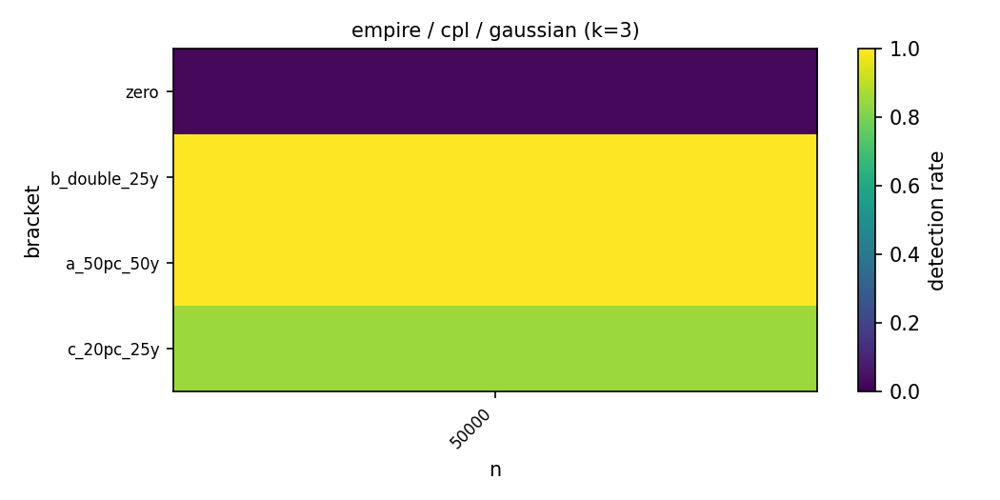

## 1 · The dates-as-data tradition, and a persistent puzzle

::: {.columns}
::: {.column width="60%"}
- 40 years of "dates as data" in archaeology (Rick 1987; Williams 2012; Timpson et al. 2014; Crema & Bevan 2021)
- LIRE v3.0: **180,609 inscriptions**, 50 BC – AD 350 (Kaše et al. 2023)
- **The recurring objection**: counts reflect *cultural enthusiasm to inscribe* — the **epigraphic habit** — more than anything else (MacMullen 1982; Hanson 2021)
- **Our question**: how much demographic signal survives once we account for editorial distortion?
:::
::: {.column width="40%"}
{fig-align="center"}
:::
:::

<!--
SPEAKER NOTES — slide 1 (≈ 90 s):
Set up the project as a contribution to the dates-as-data conversation
that has been running for ~40 years in radiocarbon archaeology and is
now becoming live in epigraphic studies (cite Heřmánková, Kaše,
Sobotková 2021 if asked). Acknowledge the audience's likely
scepticism head-on: the "habit only" position is a well-established
critique. Frame the talk as a methodological contribution that
takes that critique seriously — by separating editorial distortion
from underlying signal before doing any substantive analysis —
and asks how much residual demographic signal is left when we do.

Tone: open, exploratory, inviting feedback. We are NOT claiming to
have settled the debate, we are claiming to have a methodological
framework that lets the debate proceed on better evidence.
-->

---

## 2 · Editorial distortion has a measurable signature

::: {.columns}
::: {.column width="55%"}
{fig-align="center" width="100%"}

- **54.5 %** of `not_before` end in `01`; **53.0 %** of `not_after` end in `00`
- Largest step in the SPA: **+1,159 at the 1 BC / AD 1 boundary**
- Narrow spikes at AD 77.5 (Flavian), 122.5 (Hadrianic), 212.5 (Severan)
:::
::: {.column width="45%"}
{fig-align="center" width="100%"}

**Reading the signature**:

- Wide templates → editorial encoding artefact
- Narrow spikes → real ancient clustering (sustain under high-precision filter)
:::
:::

<!--
SPEAKER NOTES — slide 2 (≈ 110 s):
The audience knows from experience that some dates in the corpus are
"AD 1 – 100" or "Hadrianic" rather than precise years, but they may
not have seen the empirical signature decomposed this cleanly. The
key takeaway: wide-template intervals deposit FLAT PLATEAUS of mass
(under uniform aoristic), not preferential mass at the midpoint —
and the empirical SPA shows exactly that. The plateau-step structure
at century boundaries is the editorial artefact. The narrow spikes
at AD 77.5 / 122.5 / 212.5 are NOT artefact — they amplify under
narrow-precision filtering, meaning they're real ancient regnal
clustering surviving in the precisely-dated subcorpus.

This slide is the EMPIRICAL CASE that editorial distortion is real,
measurable, and separable. It earns the audience's attention for the
methodological argument that follows.
-->

---

## 3 · What we can resolve: Phase 1 reachability

::: {.columns}
::: {.column width="45%"}
{fig-align="center" width="100%"}
:::
::: {.column width="55%"}
**Phase 1** asks: at each analysis level, how many inscriptions does a unit need before deviation-detection reliably sees a known effect?

For the binding 50 %-over-50-y bracket (Gaussian-tapered, conservative):

- **Empire**: reachable at n = 50,000
- **Province / Urban area**: min n ≈ **1,549** (exp / Gauss; range 1,385 – 1,938 across nulls)
- **96 H1-reachable cells** across empire / province / urban-area

These thresholds **gate** the per-subset deviation-detection analyses; locked at OSF lodgement.
:::
:::

<!--
SPEAKER NOTES — slide 3 (≈ 100 s):
Phase 1 is COMPLETE methodology, locked at OSF lodgement. The point
to communicate to the audience: we are not running every test on every
small subset — we did the simulation work first to determine where
the data has enough statistical power to support a test. This is a
PREREGISTERED minimum-N gate; cells that don't clear it are flagged
"unreachable" rather than reported with inflated false-positive rates.

The 96-cell reachability map is a public scientific result on its own
— other epigraphic-corpus studies could use these thresholds as a
methodology reference. Worth mentioning that the v2 simulation
achieved false-positive control ≤ 5 % across all 96 zero-effect cells
(range [0.007, 0.049]) — properly calibrated.

If asked about the math: forward-fit null in true-date space, then
synthetic-from-null DGP with empirical aoristic widths bootstrapped
in, 1,000 iterations × 1,000 MC replicates per cell.
-->

---

## 4 · What the data look like at multiple scales

::: {.columns}
::: {.column width="50%"}
{fig-align="center"}
:::
::: {.column width="50%"}
{fig-align="center"}
:::
:::

- Editorial distortion (plateau-steps) visible; **mixture correction is the preregistered Phase 2 work** (next slide)
- **Pompeii cuts off at AD 79** — smoking-gun validity check

<!--
SPEAKER NOTES — slide 4 (≈ 110 s):
Show the data. The point here is empirical, not statistical: at every
analysis scale we look at, there's structure beyond a uniform
distribution. The editorial artefact is present but doesn't drown out
the underlying signal — especially at smaller scales where individual
city / province dynamics start to show through.

Be explicit: these are RAW, not mixture-corrected. The mixture model
discussed next is the proposed correction. We're showing the
uncorrected data first because (a) it's what the field traditionally
analyses and (b) the editorial-distortion problem we identified on
slide 2 lives in these curves.

If the audience asks "which city subset shapes look most interesting?"
— that's a great Q&A opening for substantive interpretation later.
-->

---

## 5 · The preregistered fix: Bayesian mixture decomposition

::: {.columns}
::: {.column width="55%"}
**Model** (preregistered):

$$
y_t \sim \mathrm{Multinomial}(N,\ \alpha \cdot p^{\text{conv}}_t + (1-\alpha)\cdot p^{\text{gen}}_t)
$$

- $p^{\text{conv}}$ = template-slab dictionary (century / half-century / reign-interval)
- $p^{\text{gen}}$ = smoothed "real ancient" SPA
- $\alpha$ = empire-level mixing weight

**Validation**: preregistered recovery-simulation grid; supplementary Dirichlet-multinomial + rescaled NegBin fits reported alongside.
:::
::: {.column width="45%"}
{fig-align="center" width="100%"}

Synthetic cell, N = 5,000, true α = 0.50. **α posterior covers truth** (median 0.477, 95 % CI [0.414, 0.541]); **shape Pearson r = 1.000**; all prereg validation gates pass. *Schematic only; full grid post-talk.*
:::
:::

<!--
SPEAKER NOTES — slide 5 (≈ 110 s):
This is the METHODOLOGICAL CORE of the talk. The mixture decomposition
formalises the empirical decomposition we showed on slide 2: the
observed SPA is α × convention component + (1 − α) × genuine signal,
where the convention component is built from the empirically-attested
template intervals (century slabs, half-century slabs, reign-interval
slabs from Decision 20). Year-precise inscriptions are NOT in the
convention component — they remain in the genuine signal as real
anchors.

If we have the A+ recovery demo: show that on a synthetic dataset
with KNOWN α and KNOWN genuine shape, the model recovers both. This
is the validation principle the preregistered grid (~ 100 replicates
per cell) extends to.

If we do NOT have the A+ demo: show the schematic and the recovery-
sim grid description, emphasising preregistration as the validation
commitment.

Be careful with claims: "preliminary, post-lodgement; the
preregistered analysis is forthcoming."
-->

---

## 6 · Preliminary scaling: does Hanson population predict inscription count?

::: {.columns}
::: {.column width="55%"}
{fig-align="center"}

**Preliminary frequentist result (date-window-filtered counts; Rome excluded)**:

| Statistic | Value | Comparator |
|---|---|---|
| NBR β (preliminary) | **0.566** | Hanson 2021: β = 0.672 (95 % CI [0.588, 0.756]) |
| Bootstrap 95 % CI | [0.543, 0.574] | Carleton et al. 2025 (elite-honorific): β ≈ 0.3–0.5; no-zeros ~ 0.68 |
| OLS log-log β | 0.284 (R² = 0.04) | OLS is the Hanson-direct comparator, but is dampened here by the low-count tail |
| n (cities) | **1,044** | Hanson 2021: 554 sites |
:::
::: {.column width="45%"}
**Claim**: population accounts for *some* of the cross-city variation in inscription count — the habit-only critique cannot be the whole story.

**Caveats**:
- Frequentist NBR; the **binding** analysis is the Bayesian within-between Mundlak NBR on the next slide
- Row-resample bootstrap underestimates between-city heterogeneity vs the Mundlak posterior
- Cumulative (not peak) counts vs Hanson's max-theoretical populations
- This is **preliminary, post-lodgement**; not a confirmatory test
:::
:::

<!--
SPEAKER NOTES — slide 6 (≈ 100 s):
This is the FREQUENTIST COMPARATOR — directly comparable to Hanson 2021
(β = 0.672) and Carleton et al. 2025 (β ≈ 0.3-0.5 across specs).

Be HONEST about what this is:
- Frequentist NBR with row-resample bootstrap (not the preregistered
  Bayesian within-between Mundlak — that's the next slide)
- 1,044 Hanson-matched cities, Rome excluded (the prereg quotes "~815"
  which was inherited from a 2024-notebook Latin-province subset; we
  follow the prereg's TEXT spec, which is broader; addressed in the
  speaker notes for slide 6b)
- Cumulative counts; preliminary, post-lodgement

The β = 0.566 sits BETWEEN Hanson 2021 (0.672) and Carleton's main range
(0.3-0.5), close to Carleton's "no-zeros" variant (~ 0.68). This is the
"sublinear scaling" claim broadly reproduced. The OLS log-log β = 0.284
is dampened by the low-count tail (R² is only 0.04) — illustrates why
NBR is the better specification for over-dispersed count data.

The within-province / between-province decomposition on the next slide
is the prereg's BINDING analysis — that's where the headline f_within
number lives.
-->

---

## 6b · The preregistered binding analysis: within-province population effect

::: {.columns}
::: {.column width="60%"}
{fig-align="center" width="100%"}
:::
::: {.column width="40%"}
**Mundlak NBR on 1,044 cities ex-Rome**:

- β_within = **0.587**
- β_between ≈ −0.26 (CI straddles 0; not separately identifiable)
- **f_within = 0.299, 95 % CI [0.240, 0.366]**
- **Verdict (3-way): supported**

**~ 30 % of city-to-city variation → within-province population.** The other ~ 70 % = habit + convention + survival + admin structure.
:::
:::

<!--
SPEAKER NOTES — slide 6b (≈ 130 s):
THIS IS THE SUBSTANTIVE PUNCHLINE. It is the preregistered binding
analysis — Bayesian within-between (Mundlak) NBR on 1,044 Hanson-matched
cities, Rome excluded.

The within-between decomposition is the methodological key. Each
city's log(population) splits into (i) the province-mean log(population)
and (ii) the city's deviation from its province-mean. β_within is the
coefficient on the deviation — it's the WITHIN-PROVINCE population
effect, orthogonal to province membership. β_between is the
between-province effect, but explicitly flagged as not separately
identifiable from province-level habit / convention / survival.

The headline number f_within = 0.30 means: about 30% of the variance in
log expected inscription count across cities is explained by the
within-province population component. The remaining 70% is "everything
else" — habit, monumental practice, survival bias, provincial
administrative structure, etc. This is the COMPLEXITY DECOMPOSITION
from Shawn's abstract: SPA outputs read NOT as raw population proxy
but as composite of population + habit + structure + survival; this
slide ISOLATES the population component.

Verdict per the prereg's three-way rule: posterior 95% CI on f_within
is [0.240, 0.366], WHOLLY ABOVE the 0.10 threshold → "supported". With
P(f > 0.20) ≈ 1.0, the within-province population signal is very robust
under this preliminary fit.

Caveats to acknowledge (sample size is bigger than prereg's "~815"
quote — see slide 6 notes — and there's a long agenda of robustness
work pre-specified: aoristic-MC sensitivity, three-weighting variance
sensitivity, Hanson-population measurement-error sensitivity, brms-vs-
pymc shadow validation. All preregistered, post-talk.)

Anticipate audience pushback:
- "But you haven't applied the mixture correction to these counts!"
  → Correct, and intentional. The cross-sectional H3a regression
  operates on date-window-filtered counts; the mixture correction is
  for the TEMPORAL SPA analyses (H2.1, H3b). The cross-sectional
  artefact protection is the 50 BC – AD 350 date-window filter itself.
  Per-city mixture would be unidentified for ~ 600 of the cities below
  N=100 inscriptions.
- "What about province as a fixed predictor?" → β_between captures
  that; we report it but flag its non-identifiability from province-
  level everything-else.
- "Subgroup analyses?" → Pre-specified in prereg §5 (small-N
  trajectory work). Out of scope for the 12-min talk.
-->

---

## 7 · Where this is heading, and what we'd love feedback on

::: {.columns}
::: {.column width="50%"}
**Lodged on OSF 2026-05-20** — `osf.io/uycs6` _(embargoed pending review decision)_:

- **Phase 2**: Bayesian mixture validation (recovery grid)
- **Phase 3 / H3a**: Mundlak NBR + `f_within` verdict (today's headline result, preliminary)
- **H3b**: deviation-detection at Antonine plague + 3rd-c. Crisis
- **H3c**: provincial-capital residuals + Moran's I (Hanson 2021 replication)
- 13 named sensitivity / exploratory analyses

Public repo at the lodgement tag (link in footer).
:::
::: {.column width="50%"}
**Questions for this room**:

1. **For the LIRE / SDAM team**: does the editorial-template decomposition match how dates are assigned in EDH / EDCS / LIRE?

2. Mundlak attributes **~ 30 %** of city-to-city variation to within-province population. **Which sub-mechanisms** drive the other ~ 70 % — and how would we distinguish them?

3. **Negative-control subgroups** (habit-dominant) or **independent demographic anchors** we should consult?
:::
:::

<!--
SPEAKER NOTES — slide 7 (≈ 80 s):
Close with three things:

1. The PROJECT is preregistered (cite OSF DOI when available) — open
   science commitment, all confirmatory tests pinned BEFORE data is
   touched.
2. The REPOSITORY is public and pinned at the lodgement tag — readers
   can clone, browse, replicate.
3. We WANT FEEDBACK — this is a feedback-seeking talk, not a results
   presentation. The four questions on the right are the openings we
   want the audience to engage with. Adela can adapt these on the day
   based on session theme.

End with thanks; invite questions; have a couple of backup figures
ready if Q&A goes substantive.

Backup material to have ready (NOT on the deck, but in a backup file):
- The post-lodgement OSF DOI when available
- The decision log / changelog if anyone asks about methodological
  choices
- Specific Carleton et al. 2025 β values for the elite-honorific
  subsets
- The Phase 1 power-curve figures for any specific bracket
- The mixture-recovery demo (if completed but not slide-fronted)
-->

---

## Backup slides (not in main 12-min flow)

### B1 · Hanson's residual findings

If asked about replicating Hanson 2021's specific findings:
- Provincial capitals over-produce inscriptions (mean residual 0.43 vs ~0.06 for coloniae / municipia)
- Moran's I = 0.046 on residuals (significant clustering)
- Moran's I = -0.006 on raw counts (no clustering — the clustering is in the residuals)

Our H3c is a preregistered replication of both findings.

### B2 · Why both frequentist and Bayesian on the deck?

- The **frequentist NBR** (slide 6) is the direct comparator to Hanson 2021 (β = 0.672) and Carleton et al. 2025 (β ≈ 0.3 – 0.5; no-zeros ≈ 0.68); it's an empire-wide scaling coefficient
- The **Bayesian within-between Mundlak NBR** (slide 6b) is the *preregistered binding analysis* — it isolates the *within-province* population effect, orthogonal to province membership, and yields a posterior on the variance-fraction estimand fwithin
- The two specifications answer related but distinct questions; the Mundlak βwithin = 0.587 sits inside the bootstrap CI of the empire-wide NBR β = 0.566 [0.543, 0.574] — qualitatively consistent
- Sample sizes differ slightly between the two: 1,044 Hanson-matched cities ex-Rome in both; the Mundlak fit further partitions by 56 provinces for the random-intercept structure

### B3 · Why the 50 BC – AD 350 envelope?

- Constrains the data-attribution artefact (late-Republic dating is sparse; post-AD 350 is Late Antique with different epigraphic conventions and different cultural-political context)
- Aligned with Hanson 2016's reference period (100 BC – AD 300, with our extension to AD 350)
- Roughly the imperial-era period during which urban populations and inscription production overlap

### B4 · Why exclude Rome?

- Rome contributes 65,435 inscriptions to the filtered corpus — 36.2 % of the total
- It dominates the scaling fit as a single outlier
- Hanson 2021 also excludes Rome from scaling (Table 7.3 caption)
- Reported transparently; not tested as a sensitivity (per prereg §9)

### B5 · How the mixture model handles year-precise inscriptions

- Year-precise inscriptions ([t, t] encodings; consular or imperial-titulature dating) are *not* part of the convention component
- They remain in the genuine SPA as real ancient anchors
- The convention component is built from the *wide-template* slab structure

### B6 · Hidden Markov model (HMM) post-lodgement extension

If anyone asks about future methodological directions:
- Statistician collaborator (Martin) has proposed a state-space / HMM approach
- Treats latent population N_t as a hidden state under a stationary kernel
- Aoristic-interval emission via Cox-process integration (baorista's existing infrastructure provides the emission layer)
- Genuinely novel for archaeology (no prior art found in our literature scout)
- Would be a post-lodgement OSF amendment if pursued
- Citations: Kéry & Schaub 2012 IPM; Tingley & Huybers 2010 BARCAST
