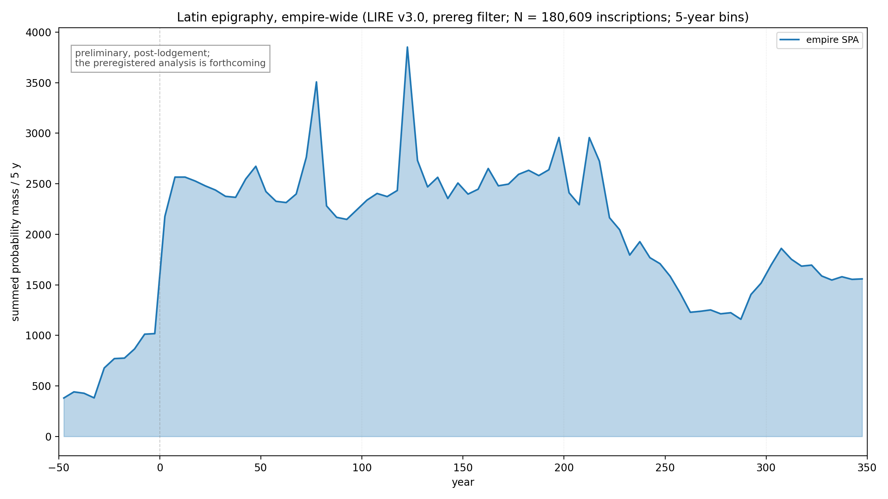
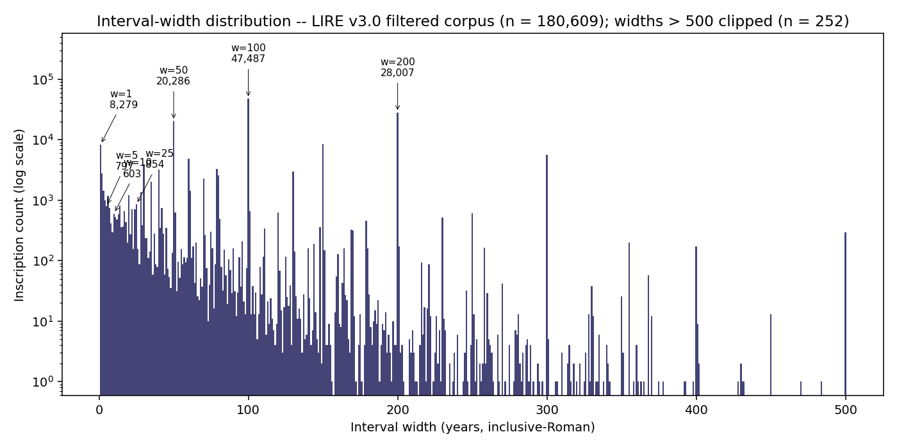
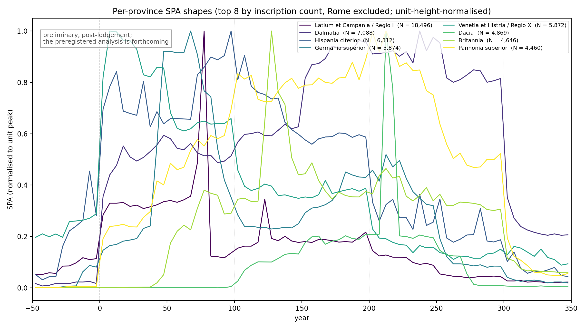
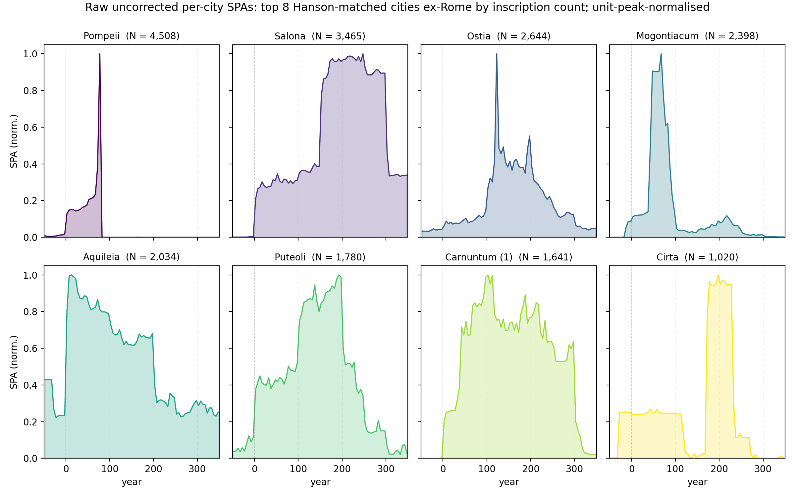
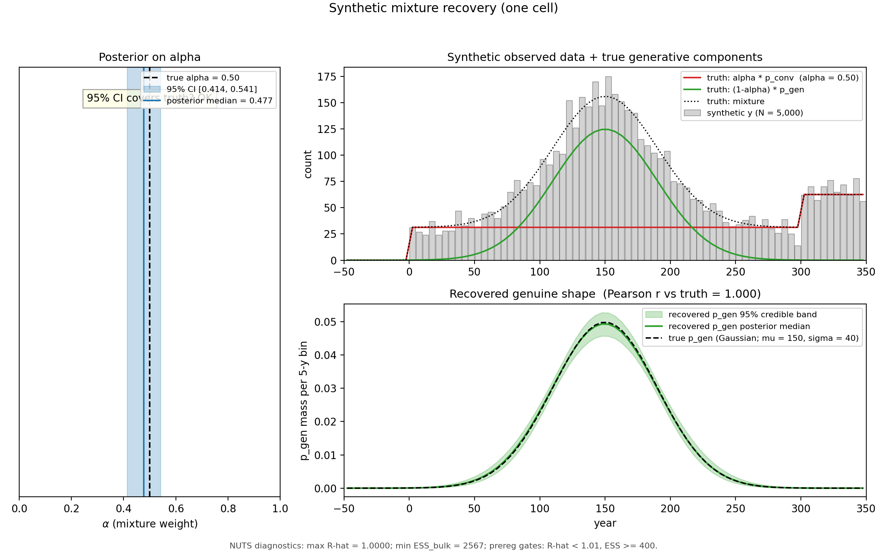
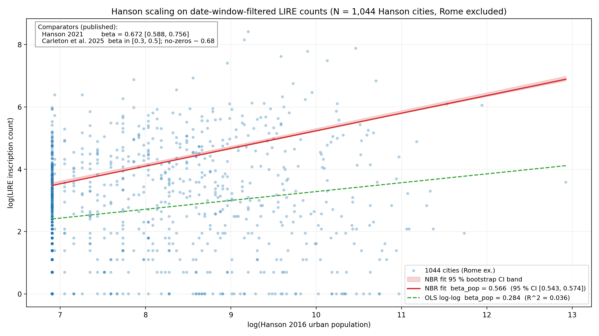
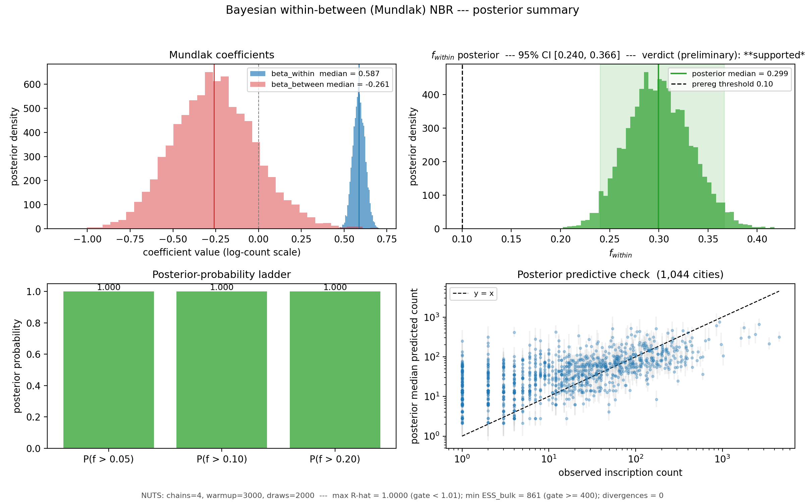

## 1 · The dates-as-data tradition, and a persistent puzzle

::: {.columns}
::: {.column width="60%"}
- 40 years of "dates as data" in archaeology (Rick 1987; Timpson et al. 2014; Crema & Bevan 2021)
- LIRE v3.0: **180,609 inscriptions**, 50 BC – AD 350 (Kaše et al. 2023)
- **The recurring objection** — the **epigraphic habit** (MacMullen 1982; Hanson 2021)
- **Our question**: how much demographic signal survives editorial distortion?
:::
::: {.column width="40%"}
{fig-align="center"}
:::
:::

<!--
SPEAKER NOTES — slide 1 (≈ 90 s):
Set up the project as a contribution to the dates-as-data conversation
that has been running for ~40 years in radiocarbon archaeology and is
now becoming live in epigraphic studies (cite Heřmánková, Kaše,
Sobotková 2021 if asked). Acknowledge the audience's likely
scepticism head-on: the "habit only" position is a well-established
critique. Frame the talk as a methodological contribution that
takes that critique seriously — by separating editorial distortion
from underlying signal before doing any substantive analysis —
and asks how much residual demographic signal is left when we do.

Tone: open, exploratory, inviting feedback. We are NOT claiming to
have settled the debate, we are claiming to have a methodological
framework that lets the debate proceed on better evidence.
-->

---

## 2 · Editorial distortion has a measurable signature

::: {.columns}
::: {.column width="55%"}
{fig-align="center" width="100%"}

- **54.5 %** of `not_before` end in `01`; **53.0 %** of `not_after` end in `00`
- Largest step in the SPA: **+1,159 at the 1 BC / AD 1 boundary**
- Narrow spikes at AD 77.5 (Flavian), 122.5 (Hadrianic), 212.5 (Severan)
:::
::: {.column width="45%"}
{fig-align="center" width="100%"}

**Reading the signature**:

- Wide templates → editorial encoding artefact
- Narrow spikes → real ancient clustering (sustain under high-precision filter)
:::
:::

<!--
SPEAKER NOTES — slide 2 (≈ 110 s):
The audience knows from experience that some dates in the corpus are
"AD 1 – 100" or "Hadrianic" rather than precise years, but they may
not have seen the empirical signature decomposed this cleanly. The
key takeaway: wide-template intervals deposit FLAT PLATEAUS of mass
(under uniform aoristic), not preferential mass at the midpoint —
and the empirical SPA shows exactly that. The plateau-step structure
at century boundaries is the editorial artefact.

DEFINING "MIDPOINTS" PROPERLY: the AD 77.5, 122.5, and 212.5 spikes are
**midpoints of regnal-interval editorial templates**, not dynasty
labels:
  - AD 77.5 = midpoint of Flavian-period consular-date templates such
    as [78, 79], [77, 79], [76, 78] (multiple consular pairs from the
    Vespasian / Titus era stacking up at this bin centre).
  - AD 122.5 = mass from Hadrian's reign template [117, 138] (552
    inscriptions) PLUS the exact-year template [123, 123] (1,304
    inscriptions encoding consular AD 123 explicitly).
  - AD 212.5 = midpoint of Severan reign-interval templates centred on
    early-3rd-century consular pairs (similar logic to AD 77.5).

DEFINING "HIGH-PRECISION FILTER": the high-precision subcorpus is the
subset of inscriptions whose stated date range is narrow — operationally,
`date_range = not_after - not_before ≤ 25` years (so inscriptions
confident to the quarter-century or finer). About 8,279 inscriptions in
the corpus have date_range = 0 (single-year-precise); about 20,286 have
date_range ≤ 25. When you re-do the empire SPA on JUST those narrow
inscriptions, the broad plateau largely dissolves (because wide-template
inscriptions get filtered out) but the regnal spikes at AD 77.5, 122.5,
212.5 INTENSIFY in relative terms — proving they're real ancient
clustering, not editorial encoding.

This slide is the EMPIRICAL CASE that editorial distortion is real,
measurable, and separable. It earns the audience's attention for the
methodological argument that follows.
-->

---

## 3 · A power simulation: which analyses are reachable?

::: {.columns}
::: {.column width="55%"}
{fig-align="center" width="100%"}
:::
::: {.column width="45%"}
Synthetic corpora with **known** deviations → run through the detection method → measure detection rate.

For the binding bracket:

- **Empire** reachable at n = 50,000
- **Province / urban-area** min n ≈ **1,549**
- **96 reachable analysis cells**
- False-positive control ≤ 5 % across all 96 zero-effect cells
:::
:::

<!--
SPEAKER NOTES — slide 3 (≈ 100 s):

WHAT THIS SLIDE IS: this is the first phase of the project's methodology
— a POWER SIMULATION completed before any substantive analysis. The
point to communicate to the audience: we are not running every test on
every small subset. We did the simulation work first to determine where
the data has enough statistical power to support a test. Cells that
don't clear the minimum-N gate are flagged "unreachable" rather than
reported with inflated false-positive rates.

DEFINING A "CELL": a single cell in the simulation grid is one
combination of {analysis level (empire / province / urban-area) ×
data subset × null-model class (exponential / piecewise-linear) ×
effect bracket (size × duration × shape — e.g. 50%-over-50y-Gaussian) ×
sample size n}. Each cell gets 1,000 synthetic replicates; detection
rate is the fraction of replicates the method correctly flags.

THE METHOD ON THE HEATMAP: each row is a different bracket (a known
effect to recover); the colour is detection rate. The bracket
"a_50pc_50y" is the binding one — a 50%-amplitude deviation over a
50-year window, smoothed with a Gaussian taper. This is the
conservative bracket we promise to detect; smaller effects are out of
scope. Yellow = nearly perfect detection; green = still detectable;
purple = below detection floor (where the zero-effect cell sits, as a
false-positive control).

WORTH SAYING ALOUD: v2 simulation achieved false-positive control ≤ 5%
across all 96 zero-effect cells (range [0.007, 0.049]) — the method is
properly calibrated. The 96-cell reachability map is a public
scientific result on its own — other epigraphic-corpus studies could
use these thresholds as a methodology reference.

IF ASKED ABOUT THE MATH: forward-fit null in true-date space, then
synthetic-from-null data-generating process with empirical aoristic
widths bootstrapped in, 1,000 simulation iterations × 1,000 Monte Carlo
replicates per cell.
-->

---

## 4 · What the data look like at multiple scales

::: {.columns}
::: {.column width="50%"}
{fig-align="center"}
:::
::: {.column width="50%"}
{fig-align="center"}
:::
:::

<!--
SPEAKER NOTES — slide 4 (≈ 110 s):
Show the data. The point here is empirical, not statistical: at every
analysis scale we look at, there's structure beyond a uniform
distribution. The editorial artefact is present but doesn't drown out
the underlying signal — especially at smaller scales where individual
city / province dynamics start to show through.

Be explicit: these are RAW, not mixture-corrected. The mixture model
discussed next is the proposed correction. We're showing the
uncorrected data first because (a) it's what the field traditionally
analyses and (b) the editorial-distortion problem we identified on
slide 2 lives in these curves.

If the audience asks "which city subset shapes look most interesting?"
— that's a great Q&A opening for substantive interpretation later.
-->

---

## 5 · Correcting editorial artefacts: Bayesian mixture decomposition

::: {.columns}
::: {.column width="45%"}
**The idea**:

- Split the observed SPA into **editorial encoding** (template intervals) **+ real ancient production** (smooth signal)
- Estimate **what fraction (α) is editorial** at the empire level
- Validate by **recovering known answers from synthetic data**
:::
::: {.column width="55%"}
{fig-align="center" width="100%"}

Synthetic cell, N = 5,000, true α = 0.50. **α posterior covers truth** (median 0.477, 95 % CI [0.414, 0.541]); **shape Pearson r = 1.000**. *Schematic only; full grid post-talk.*
:::
:::

<!--
SPEAKER NOTES — slide 5 (≈ 110 s):

THE PLAIN-ENGLISH STORY for the audience:

"We saw on slide 2 that the observed SPA is partly *real ancient
clustering* — those regnal spikes at AD 77.5, 122.5, 212.5 — and
partly *editorial encoding artefact* — the plateau-step structure at
century boundaries from inscriptions dated to wide template intervals
like '1st century AD' or 'Hadrianic'. The mixture model formalises
this decomposition.

The idea is straightforward. We say the observed shape of the SPA is
a *weighted sum* of two underlying shapes: a CONVENTION component
(what editors produce when they assign wide template intervals), and
a GENUINE component (what real ancient inscription production looked
like). The weight α tells us what fraction of the observed SPA is
editorial encoding. The model estimates α and the genuine shape
together, from the data.

The convention component isn't free-form — it's built from a small
dictionary of empirically-attested template intervals: century slabs
([1-100], [101-200], ...), half-century slabs where supported, and
reign-interval templates (Augustan, Flavian, Hadrianic, Antonine,
Severan). Year-precise inscriptions are NOT in the convention
component — they stay in the genuine signal as real ancient anchors.

WHY IT MATTERS: once we can estimate α and the genuine shape, we can
report the *corrected* temporal trajectory of inscription production
— the ancient signal with editorial encoding stripped away. This is
the input to all the temporal analyses (the Antonine plague probe,
the third-century crisis probe, the per-province trajectory work).

HOW WE'RE VALIDATING IT: shown on the right. On a synthetic dataset
where we KNOW the true α (= 0.50) and KNOW the true genuine shape (a
smooth Gaussian peaking AD 150), the model recovered both correctly:
the α posterior covered the truth (95 % CI [0.414, 0.541]) and the
recovered shape tracked the true shape with Pearson r = 1.000. This
is the principle of the full validation grid — 100 replicates per cell
across the α × shape × tier-weight × N grid — which runs post-talk.

WHAT TO SOFT-PEDAL: this is one synthetic cell with simplifications
(one tier, parametric Gaussian); the full grid will use the three-tier
dictionary and a flexible smoothness prior. The point of the
demonstration is to show the recovery principle works, not to claim
the full model has been validated.
-->

---

## 6a · Does Hanson population predict inscription count?

::: {.columns}
::: {.column width="60%"}
{fig-align="center"}
:::
::: {.column width="40%"}
**Sublinear scaling**: bigger cities produce *proportionally fewer* inscriptions per capita.

| Source | β |
|---|---|
| **Our NBR** | **0.566** |
| Hanson 2021 | 0.672 |
| Carleton 2025 (no-zeros) | ~ 0.68 |

Our 95 % bootstrap CI: [0.543, 0.574].
:::
:::

<!--
SPEAKER NOTES — slide 6 (≈ 100 s):

THE PLAIN-ENGLISH STORY:

"This is the published-comparator analysis. The classic dates-as-data
question for inscriptions is: do bigger cities produce more
inscriptions in proportion to their population, or more (super-linear),
or less (sub-linear)? Hanson 2021 reported a scaling exponent of about
0.67 — meaning a city ten times bigger produces about 10^0.67 ≈ 4.7
times as many inscriptions, not 10. Carleton et al. 2025 reported a
range around 0.3 to 0.7 depending on the inscription subset.

Our preliminary fit on the date-window-filtered LIRE corpus gives a
scaling exponent of 0.566, with a very tight bootstrap confidence
interval of 0.543 to 0.574. That sits right in the middle of the
published comparator range, slightly below Hanson 2021's 0.672 and
close to Carleton 2025's no-zeros variant of 0.68. So the sublinear
scaling claim broadly reproduces under our methodology — same family
of numbers, with our specific value at the low end of published
comparators.

WHY THIS MATTERS: if our pipeline didn't reproduce a finding the field
has already established, that would be a methodology warning sign. The
fact that we land in the published range tells us the filter, the
data-prep, and the regression are doing the right thing. With that
validated, we can move on to the new contribution — the
within-between decomposition on the next slide.

DEFINING THE NUMBERS:
- *NBR β*: the scaling exponent on the count scale. If E[insc] ∝ pop^β,
  then β = 0.566 means doubling a city's population multiplies expected
  inscriptions by 2^0.566 ≈ 1.48× (not 2×).
- *OLS log-log β = 0.284*: a different specification — straight-line
  regression on log(count) ~ log(pop). It comes out half the NBR
  exponent, with very low R². This is a methodology footnote: the OLS
  spec is dragged toward zero by the long tail of cities with N = 1
  inscription (log(1) = 0); NBR is the better choice for over-dispersed
  count data.
- *1,044 cities*: all Hanson-matched cities Rome-excluded in the
  date-window-filtered corpus. (NB: the lodged OSF preregistration
  quotes "~815" — that figure was inherited from a 2024 notebook subset
  using a Latin-language filter that we've since simplified out. The
  prereg's text spec — "all cities with Hanson population estimates,
  Rome excluded" — yields 1,044 directly. This is a methodological
  footnote we're transparent about; addressed in the prereg amendment
  trail.)

THE PROPER ANALYSIS IS NEXT: this empire-wide single-coefficient NBR
doesn't separate within-province from between-province effects. The
binding decomposition is on slide 6b.
-->

---

## 6b · How much of the variation is population, vs. everything else?

::: {.columns}
::: {.column width="60%"}
{fig-align="center" width="100%"}
:::
::: {.column width="40%"}
**Compare cities *within* a province** — that strips out province-wide effects (habit, administration, survival) and isolates the population signal.

**Result** (1,044 cities ex-Rome):

- **~ 30 %** of city-to-city variation → within-province population
- **~ 70 %** → habit, convention, survival, admin structure
- 95 % CI on the 30 % figure: [24 %, 37 %]
:::
:::

<!--
SPEAKER NOTES — slide 6b (≈ 130 s):

THIS IS THE SUBSTANTIVE PUNCHLINE. The methodology has a technical
name (a Bayesian within-between or "Mundlak" negative-binomial
regression) but the IDEA is straightforward, and that's what to
deliver to the audience.

WHAT THE METHOD DOES, IN PLAIN ENGLISH:

"We want to know whether bigger cities produce more inscriptions
because they're bigger, or because of something cultural — the
'epigraphic habit'. The problem is that habit and population are
correlated at the province level: some provinces had vigorous
epigraphic cultures across all their cities; others didn't. If we
just compare city size to inscription count across the whole empire,
those province-level differences contaminate the population signal.

So we use a method that compares cities WITHIN THE SAME PROVINCE.
Each city's population is split into two pieces — what's typical for
its province, and how much it deviates from the province's typical
city. The deviation piece is what we use to estimate the population
effect. By construction, that piece is orthogonal to province
membership — so it can't be contaminated by province-level habit,
administration, or survival bias. It's a clean within-province scaling
estimate.

(This decomposition is sometimes called a 'Mundlak' specification
after the economist who first formalised it. Negative-binomial
regression is the count-data model we use because inscription counts
are over-dispersed — far more variable than a simple count model
would predict. The Bayesian framing gives us a full posterior
distribution on the variance fraction, not just a point estimate.)"

WHAT WE FOUND:

"About 30 % of the city-to-city variation in expected inscription
production is attributable to within-province population. The other
70 % is everything else that varies between provinces — cultural
habit, monumental practice, administrative structure, survival
bias, and so on.

The 95 % credible interval on that 30 % figure is [24 %, 37 %], which
sits entirely above the 10 % threshold we preregistered as the
'supported' boundary. The probability that the within-province
population effect explains more than 20 % of the variation is
effectively 1. So the population signal is real and substantial — but
the habit-only critique still captures the larger share of the story.
Both sides of the long-running debate are partially right; this is
the first preregistered quantitative partition we know of."

WHY IT MATTERS FOR THE FIELD:

"This is a complexity decomposition, not a population claim. We
aren't saying inscription counts measure population. We're saying
that within-province inscription production carries a measurable
demographic signal — about a third of the systematic variation — and
that the remaining two-thirds is exactly the territory the habit
critique points at. Future work will try to attribute pieces of that
two-thirds to specific mechanisms (monumental practice, status
display, provincial-capital effects, religious cycles)."

Caveats to acknowledge (sample size is bigger than prereg's "~815"
quote — see slide 6 notes — and there's a long agenda of robustness
work pre-specified: aoristic-MC sensitivity, three-weighting variance
sensitivity, Hanson-population measurement-error sensitivity, brms-vs-
pymc shadow validation. All preregistered, post-talk.)

Anticipate audience pushback:
- "But you haven't applied the mixture correction to these counts!"
  → Correct, and intentional. The cross-sectional H3a regression
  operates on date-window-filtered counts; the mixture correction is
  for the TEMPORAL SPA analyses (H2.1, H3b). The cross-sectional
  artefact protection is the 50 BC – AD 350 date-window filter itself.
  Per-city mixture would be unidentified for ~ 600 of the cities below
  N=100 inscriptions.
- "What about province as a fixed predictor?" → β_between captures
  that; we report it but flag its non-identifiability from province-
  level everything-else.
- "Subgroup analyses?" → Pre-specified in prereg §5 (small-N
  trajectory work). Out of scope for the 12-min talk.
-->

---

## 7 · Where this is heading, and what we'd love feedback on

::: {.columns}
::: {.column width="50%"}
**Preregistration lodged 2026-05-20**: `osf.io/uycs6` _(embargoed)_

- Mixture validation (recovery grid)
- Mundlak NBR + within-province verdict
- Antonine plague + 3rd-c. Crisis probes
- Provincial-capital residuals + Moran's I

**Forthcoming**: statistician review; state-space / HMM alternative; trapezoidal-aoristic sensitivity.
:::
::: {.column width="50%"}
**Questions for this room**:

1. **LIRE / SDAM team**: does the editorial-template decomposition match dating practice in EDH / EDCS / LIRE?

2. **Which sub-mechanisms** drive the ~ 70 % non-population variance?

3. **Negative-control subgroups** or **independent demographic anchors**?
:::
:::

**Contact**: Shawn Ross · `shawn@fieldnote.au` — feedback warmly welcomed.

<!--
SPEAKER NOTES — slide 7 (≈ 80 s):
Close with three things:

1. The PROJECT is preregistered (cite OSF DOI when available) — open
   science commitment, all confirmatory tests pinned BEFORE data is
   touched.
2. The REPOSITORY is public and pinned at the lodgement tag — readers
   can clone, browse, replicate.
3. We WANT FEEDBACK — this is a feedback-seeking talk, not a results
   presentation. The four questions on the right are the openings we
   want the audience to engage with. Adela can adapt these on the day
   based on session theme.

End with thanks; invite questions; have a couple of backup figures
ready if Q&A goes substantive.

Backup material to have ready (NOT on the deck, but in a backup file):
- The post-lodgement OSF DOI when available
- The decision log / changelog if anyone asks about methodological
  choices
- Specific Carleton et al. 2025 β values for the elite-honorific
  subsets
- The Phase 1 power-curve figures for any specific bracket
- The mixture-recovery demo (if completed but not slide-fronted)
-->

---

## Deep dive: backup slides for Q&A {.section-title}

The slides that follow address anticipated audience questions. Adela should jump to whichever is relevant using the slide overview (press `o` in revealjs).

---

## B1 · Why exclude Rome from the scaling fit?

- Rome alone contributes **65,435 inscriptions** to the filtered corpus — **36.2 %** of the total
- As a single observation it dominates the scaling regression
- Hanson 2021 also excludes Rome (Table 7.3 caption) — methodologically consistent
- Reported transparently; **not tested as a sensitivity** (per prereg §9)

<!--
SPEAKER NOTE B1: a city with 65,435 inscriptions sits multiple log-units
above the next-largest case (Pompeii at 4,508). Including Rome would
make the regression a "one outlier vs everything else" exercise. The
sublinear scaling result holds with or without Rome; we exclude for
methodological consistency with Hanson and to keep the focus on the
"normal" city-size range.
-->

---

## B2 · Why the 50 BC – AD 350 envelope?

- **Late-Republic dating is sparse** (pre-50 BC); inscriptions there don't carry enough signal for the temporal analyses
- **Post-AD 350 is Late Antique** — different epigraphic conventions, different cultural-political context
- Aligned with **Hanson 2016's reference period** (100 BC – AD 300; our extension to AD 350)
- Roughly the imperial-era period during which urban populations and inscription production overlap

<!--
SPEAKER NOTE B2: the envelope is a date-attribution artefact protection.
Going earlier or later requires modelling different epigraphic regimes
(Republican Latin vs Late Antique Christian). An envelope extension to
AD 600 via LIST v1.2 is a candidate for a follow-up paper.
-->

---

## B3 · How uncertain are the Hanson population estimates?

- Hanson 2016 estimates are **max-theoretical** (urban footprint × density), not realised peaks
- **Preregistered sensitivity** (Phase 3, post-talk): refit H3a with `log_pop_c ~ Normal(log_pop_observed_c, σ_pop)` for **σ_pop ∈ {0.1, 0.2, 0.3}**
- Flag: if f_within shifts by > 50 % of its CI width under any σ_pop → reported as limitation

<!--
SPEAKER NOTE B3: this is exactly the audience's natural objection — the
populations themselves are noisy, so any analysis that takes them at
face value is suspect. The preregistered Bayesian measurement-error
model lets the population be a latent quantity with observation noise
σ_pop; the f_within posterior under that model is the proper response
to the question. Not yet run; preregistered post-talk.
-->

---

## B4 · Why NBR? Why not OLS log-log?

- Inscription counts are **over-dispersed** — variance grows faster than the mean (Negative Binomial dispersion α ≈ 2.15 in our fit)
- **OLS on log(count)** is dragged toward zero by the long tail of cities with N = 1 (log(1) = 0). Our OLS β = 0.284, R² = 0.04 — half the NBR estimate, near-zero explanatory power
- NBR correctly models count variance scaling with mean → β = 0.566, tight bootstrap CI

<!--
SPEAKER NOTE B4: this is methodologically important and worth landing
clearly with a stats-curious audience. The specification matters
because OLS log-log assumes Gaussian noise on log-counts at a constant
scale, but low-count cities have much higher relative noise. NBR
handles that. The published comparators (Hanson 2021, Carleton 2025)
use OLS log-log — our preliminary fit at NBR sits in the same family,
which validates the methodology while pointing to a spec improvement.
-->

---

## B5 · Why not fit the mixture model per-city?

- For ~ 600 of the ~ 1,000 Hanson cities with N < 100 inscriptions, the mixture is **unidentified** — too few counts to separate convention from genuine
- The cross-sectional H3a regression instead uses **the date-window filter** as its artefact protection
- The empire-level mixture α posterior is reported as **descriptive context only**, not propagated into H3a's variance-fraction CI

<!--
SPEAKER NOTE B5: identifiability matters. Even with a perfect model,
you can't extract a 5-parameter mixture decomposition from 30
inscriptions. The empire-level fit (with N = 180,609) has plenty of
data; per-city fits don't. The 50 BC – AD 350 date-window filter does
the artefact-protection job for the cross-sectional analyses; the
mixture handles only the temporal analyses (H2.1 validation, H3b
deviation-detection).
-->

---

## B6 · How does the mixture treat year-precise inscriptions?

- Year-precise inscriptions ([t, t] consular or imperial-titulature dates) are **NOT** part of the convention component
- They remain in `p_gen` as **real ancient anchors**
- The convention component is built only from **wide-template slabs** (century, half-century, reign-interval)

<!--
SPEAKER NOTE B6: this matters because year-precise inscriptions are the
strongest signal of genuine ancient production. AD 122.5 is partly
driven by the exact-year template [123, 123] (1,304 inscriptions
explicitly dated by consular AD 123). Folding those into the convention
component would mean treating real ancient anchoring as artefact —
methodologically wrong.
-->

---

## B7 · Survival and publication bias

- The **between-province** Mundlak coefficient is **not separately identifiable** from province-level survival bias
- The **within-province** coefficient is more defensible — it assumes roughly equal survival within a province (a much weaker assumption)
- LIRE aggregates EDH + EDCS coverage → we inherit their editorial decisions and coverage gaps
- **Reported as limitation** in prereg §9

<!--
SPEAKER NOTE B7: this is the survival-bias objection in its specific
form. If Hispania's epigraphic record is better preserved than
Britannia's, that's absorbed into α_province (the province random
intercept), not into β_within. So the within-province population
estimate is robust to province-level survival differences. What it's
NOT robust to is within-province survival differences (e.g., one city
in a province got buried by a volcano — but that's exactly Pompeii,
and Pompeii's cut-off pattern is empirically visible rather than
hidden).
-->

---

## B8 · The sample-size footnote: 1,044 vs the prereg's "~815"

- Prereg quotes "~815 Hanson-matched cities" Rome-excluded
- We use **1,044 cities** — the text-spec-faithful denominator from the LIRE parquet
- The "~815" figure was inherited from a 2024 notebook subset that applied an extra `province_language == 'Latin'` filter via a manually-curated mapping that isn't in LIRE
- **Logged for the OSF amendment trail**; not a confirmatory deviation

<!--
SPEAKER NOTE B8: only mention this if asked. It's a transparency
footnote — we found a discrepancy between the prereg's quoted N and
what the text-spec produces from the data. We're going with the
text-spec. Will be addressed in the amendment trail.
-->

---

## B9 · Can small-N cities (100–250 inscriptions) tell us anything?

- **For temporal deviation-detection**: NO — Phase 1's N ≈ 1,549 floor for credible 50%-over-50y detection. Inscription series below this are too sparse for formal inference
- **For descriptive shape claims**: YES — visual peaks / declines / plateaus carry information
- **For the cross-sectional H3a regression**: YES — all 1,044 cities (no minimum N) contribute leverage
- **Layer B inversion** (prereg §5): tentatively map inscription trajectory to illustrative population trajectory under stated assumptions

<!--
SPEAKER NOTE B9: this is the historian's natural question. The answer
is nuanced: small-N cities are not "noise" but they're also not
quantitative time-series. They carry shape information that's useful
when triangulated with archaeological / textual / numismatic evidence;
they're too sparse to bear formal inferential load on their own. The
prereg's §5 Layer A (descriptive shape comparison) and Layer B
(tentative inversion to population trajectory under assumption) are
the framings to use. Best practice: use the inscription series to
corroborate inferences from other evidence streams, not to carry them.
-->

---

## B10 · Hanson's residual findings (Hanson 2021 replication)

If asked about replicating Hanson 2021's specific findings:

- **Provincial capitals over-produce** inscriptions relative to scaling expectation (Hanson's mean residual 0.43 vs ~0.06 for *coloniae* / *municipia*)
- **Moran's I = 0.046** on residuals (significant spatial clustering)
- **Moran's I = −0.006** on raw counts (no clustering — clustering is in the residuals)
- **Our H3c** is a preregistered replication of both findings (post-talk)

<!--
SPEAKER NOTE B10: Hanson's residual structure is itself a substantive
historical finding — it says provincial capitals are not just bigger,
they're a *different kind* of city for epigraphic purposes. Our
preregistered H3c is the two-part replication test on the LIRE corpus.
-->

---

## B11 · Martin's state-space / HMM alternative

Statistician collaborator (Martin) has proposed a state-space / HMM approach for future methodological work:

- Treats **latent population N_t** as a hidden state under a stationary kernel
- **Aoristic-interval emission** via Cox-process integration (baorista's existing infrastructure provides the emission layer)
- Genuinely novel for archaeology (no prior art in our literature scout)
- Post-lodgement **OSF amendment** if pursued
- Citations: Kéry & Schaub 2012 (Integrated Population Models); Tingley & Huybers 2010 (BARCAST)

<!--
SPEAKER NOTE B11: this is the "future methodological directions" line
of questioning. Martin's proposal would make the population a latent
time-series rather than a static value joined from Hanson 2016; the
inscription series becomes an emission of the latent population
process. State-space / HMM machinery is well-developed in ecology and
climate science but hasn't been applied to epigraphic corpora.
Genuinely novel and exciting; on the post-talk agenda.
-->

---

## B12 · Why both frequentist and Bayesian on the deck?

- **Frequentist NBR** (slide 6a) → direct comparator to **published OLS log-log** literature (Hanson 2021, Carleton 2025)
- **Bayesian Mundlak NBR** (slide 6b) → preregistered binding analysis; isolates the within-province population effect via the within-between decomposition
- The two answer related but distinct questions; **β_within = 0.587** sits inside the empire-wide bootstrap CI **[0.543, 0.574]** — qualitatively consistent
- Sample: 1,044 cities ex-Rome both; Mundlak adds 56 provinces for random-intercept structure

<!--
SPEAKER NOTE B12: this is the "why two analyses?" question. They serve
different purposes: comparator validation (slide 6a) and the new
substantive contribution (slide 6b). They land in the same ballpark,
which validates the methodology; the Mundlak split is the genuine new
information.
-->

---

## B13 · Reachability across sample size and effect size

::: {.columns}
::: {.column width="55%"}
{fig-align="center" width="100%"}
:::
::: {.column width="45%"}
**For a given subset / unit of N inscriptions**, the table reads off what kinds of temporal deviations the preregistered envelope test can credibly detect.

- Below **N ≈ 1,000**, almost no effect is reliably detectable
- **50 %-over-50 y** events: need N ≈ 2,500
- **20 %-over-25 y** events: not reachable at any practical N — below the method's resolving power
- Smaller subsets still participate in cross-sectional regressions (6b) and descriptive-shape comparison (B9)
:::
:::

<!--
SPEAKER NOTE B13: this is the answer to "isn't the 1,549 threshold too
restrictive?" objection. Show the full grid: small datasets aren't
useless, they're just restricted to descriptive / cross-sectional
work. The 1,549 number is the binding-bracket conservative reading;
the grid shows what's reachable across the broader effect-detection
envelope. The smallest events (20 % over 25 y) are below the method's
resolving power at any practical N — that's a property of the data,
not of our specific method.

Worked-example anchor for Q&A: a hypothetical collegia subset with
~ 3,000 inscriptions reads off as REACHABLE at the binding bracket for
the empire-wide trajectory; PARTIAL at provincial level; OUT OF SCOPE
at single-city level. The historian knows BEFORE running the analysis
what claims the subset can support.

Also mention briefly: this is for ONE specific method (the
preregistered permutation-envelope test). Bayesian aoristic methods
(baorista, Crema 2025) may have different reachability profiles —
flagged as a Tier 3 / 4 follow-up.
-->

---

## Methods glossary (for the stats-curious) {.section-title}

Plain-English explanations of the statistical operations in this talk, aimed at intelligent undergraduates from any humanities discipline. Adela should jump to whichever slide answers an audience question (press `o` for overview).

---

## G1 · What is a Summed Probability Analysis (SPA)?

When we ask "how many inscriptions were produced per decade across the Empire?", most inscriptions don't have a single-year date — they're dated to a *range* like "AD 50–100" or "the reign of Hadrian". So we can't just count inscriptions per year.

An SPA treats each inscription's date as a **probability distribution** over the range it could fall in. An inscription dated AD 50–100 contributes 1/50 of a unit of evidence to each year from 50 to 99. Add up the contributions across all inscriptions and you get a "summed probability" curve — the expected number of inscriptions per year.

The *shape* of the SPA tells you how production varied over time.

---

## G2 · What is "aoristic" dating?

"Aoristic" means a date is known to be within a range rather than at a point. An inscription with `not_before = AD 50, not_after = AD 99` is aoristic — produced somewhere in that 50-year window.

**Uniform aoristic** is the simplest treatment: spread an inscription's "1 unit of evidence" *evenly* across its range — 1/50 per year for a 50-year interval. **Trapezoidal aoristic** is an alternative: more mass at the middle, less at the ends (closer to how editors might mentally anchor).

The project uses uniform aoristic as the primary specification and preregistered a trapezoidal sensitivity check. Pilot diagnostics show Pearson r ≈ 0.94 between the two — quantitatively consequential, not qualitatively decisive.

---

## G3 · What is a power simulation?

A power simulation asks: *if a real effect existed in the data, would my analysis method detect it?*

The procedure:

1. **Construct synthetic data** where you *know* the answer in advance (e.g., plant a 50 %-over-50-year bump in inscription production)
2. **Run your method** on the synthetic data and see whether it detects the planted effect
3. **Repeat 1,000 times per scenario** and measure the detection rate

If detection rate is high (> 80 %), the method is *reachable* at that sample size. If detection rate is low, the method can't reliably see real effects of that size — you'd be claiming "no effect" even when the effect IS there. Phase 1 (slide 3) is this exercise across 96 combinations of analysis level × subset × effect size.

---

## G4 · What is a Bayesian mixture decomposition?

A **mixture model** says the observed data is a *weighted sum* of two (or more) underlying components. For our analysis:

  observed SPA = α × editorial encoding + (1−α) × real ancient production

The model's job is to figure out α (the mixing weight) and the shape of each underlying component from the observed total.

**Bayesian** means we get a *probability distribution* over plausible values of α and the underlying shapes — not just a single best guess but a full description of the uncertainty.

The trick that makes this work is that the editorial-encoding component isn't a free shape — it's built from a small dictionary of known editorial templates (century slabs, half-century slabs, reign-interval templates). That constraint makes the decomposition *identifiable*: there's only one way to split the data that fits well.

---

## G5 · What is Negative Binomial Regression (NBR)?

NBR is a regression model for **count data** — like inscription counts per city. It's the right tool when:

- The outcome is a non-negative integer (0, 1, 2, …)
- The data is **over-dispersed**: variance grows faster than the mean

For inscription counts, both apply. A typical Roman city might produce 50 inscriptions on average, but the variability across cities is much higher than 50 (which is what a simple Poisson model would predict). NBR adds an over-dispersion parameter that explicitly allows for this.

The NBR coefficient β on log(population) is the **scaling exponent**: expected inscription count grows as population^β. β = 1 means linear scaling; β = 0.566 (our result) means *sublinear* — bigger cities produce *proportionally fewer* inscriptions per capita than smaller ones.

---

## G6 · What is OLS log-log — and why does it fail here?

OLS (Ordinary Least Squares) is the classic straight-line regression. "Log-log" means both predictor and outcome are log-transformed before fitting.

The published inscription-scaling literature (Hanson 2021, Carleton 2025) uses OLS on `log(inscription count) ~ log(population)`. The trouble for our corpus is that we have many cities with **inscription count = 1**, where `log(1) = 0`. Those cities collapse the bottom of the regression to a horizontal line, **flattening the slope**.

Our OLS log-log result (β = 0.284, R² = 0.04) is exactly this artefact: **half the NBR slope**, with near-zero explanatory power. NBR correctly handles count variance scaling with the mean and doesn't suffer the low-count distortion.

This isn't a contradiction with published results: same spec on a different corpus with different filtering can give a very different number (Hanson 2021's 0.672).

---

## G7 · What is the Mundlak (within-between) decomposition?

This is the statistical move that lets us **separate** the within-province population effect from province-level "everything else".

Each city's `log(population)` is split into two pieces:

1. The **province-mean log(population)** — typical city size in this province
2. The city's **deviation** from that province mean — how much bigger or smaller than typical

Both enter the regression with their own coefficients. **β_within** is the coefficient on the *deviation* — by construction orthogonal to province membership, so it's an unconfounded within-province effect. **β_between** is the coefficient on the province mean — explicitly *confounded* with everything else that varies between provinces.

Named after Yair Mundlak (1970s).

---

## G8 · What does fwithin mean?

**fwithin** is a **variance fraction** — what proportion of the systematic variation in expected inscription count across cities is attributable to within-province population:

  fwithin = Var(βwithin × within-province deviation) / Var(total expected log-count across cities)

A value of **0.30** means **30 %** of city-to-city differences in *expected* inscription count are explained by within-province population. The remaining 70 % lives in:

- Province random intercepts — habit, culture, administration, survival (the biggest chunk)
- A small + statistically null between-province population gradient
- Component covariances

A variance fraction (not a slope coefficient) tells you how much of the *variation* the effect accounts for. A slope alone wouldn't.

---

## G9 · Bootstrap CIs vs Bayesian credible intervals

Both express uncertainty about a quantity (like β or fwithin) — but they come from different procedures.

**Bootstrap CI (frequentist)** — slide 6a NBR β; slide 1 empire-SPA band. Resample the dataset many times *with replacement*, refit on each resample, take the 2.5th–97.5th percentile. Tells you how much your estimate would change *if you'd sampled slightly different data*.

**Credible interval (Bayesian)** — slide 5 α posterior; slide 6b βwithin, fwithin. The model gives you a probability distribution over plausible parameter values directly; the 95 % credible interval is the central 95 % of that distribution. Tells you where the parameter *probably is*, given the data and the model.

Both read as "95 % intervals" and in our analyses they agree closely — but the underlying inference is different.
