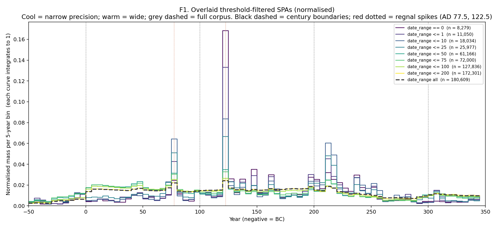
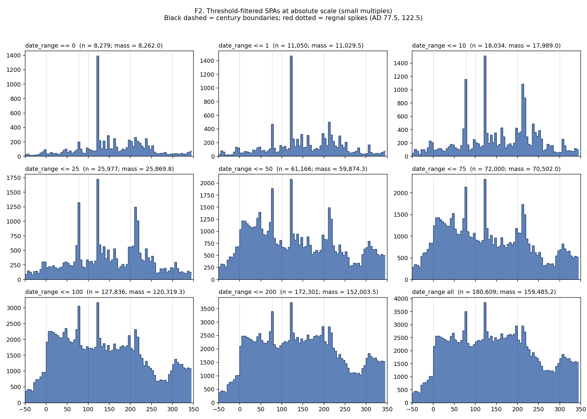
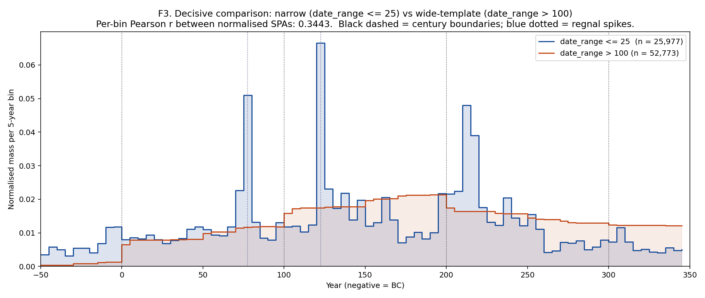
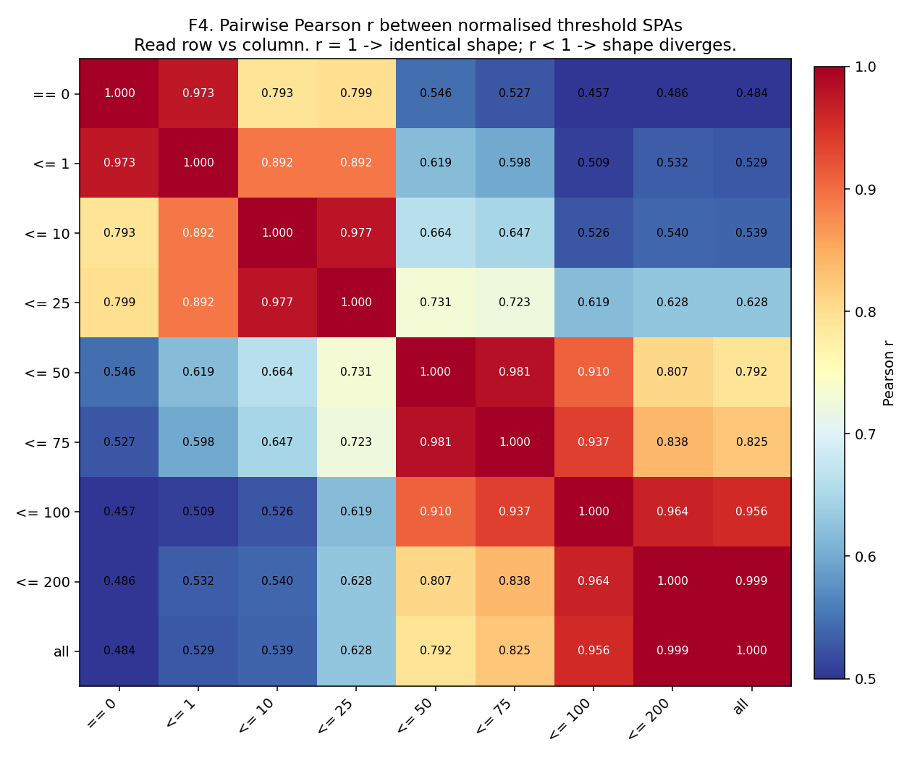

# Date-range threshold-filtered SPAs of LIRE v3.0

**Date:** 2026-05-17  
**Author:** Claude (Opus 4.7, 1M context) on Shawn Ross's brief  
**Filtered corpus:** 180,609 rows (LIRE v3.0, prereg filter: is_geotemporal AND is_within_RE AND envelope overlap with 50 BC -- AD 350)  
**Sister diagnostics:**  
  - `runs/2026-05-17-interval-width-diagnostic/outputs/REPORT.md`  
  - `runs/2026-05-17-empirical-spa-shape/outputs/REPORT.md`  

## Brief

The previous two diagnostics in this chain established that (i) LIRE v3.0 is dominated by exact-century-template intervals ([1, 100], [101, 200] etc., 26% of the filtered corpus); and (ii) the empirical SPA's actual narrow spikes are at regnal / consular dates (AD 77.5 Flavian, AD 122.5 Hadrianic), not at arithmetic anchor years (AD 50 / 150 / 250). Wide-template removal lowers the plateau but leaves regnal spikes intact.

This run progressively restricts the corpus by `date_range = not_after - not_before`, recomputing the per-year uniform-aoristic 5-year-binned SPA at each threshold. If narrow inscriptions (`date_range <= 25`) reveal a credible smooth production curve, the wider-template inscriptions are mostly carrying the artefact and the convention component needs a century-slab tier. If narrow inscriptions still show pronounced regnal spikes, those spikes are real (not artefact) and the convention component should leave them alone.

## N retained at each threshold

`date_range = not_after - not_before` (exclusive form, matching Shawn's earlier notebook semantics). `date_range == 0` is single-year-precise. The SPA mass column is a sanity check: for inscriptions entirely inside the envelope it equals N exactly; the small N - mass differences reflect partial-overlap edge inscriptions.

| Threshold | N inscriptions | Total SPA mass | N - mass |
|---|---|---|---|
| `== 0` | 8,279 | 8,262.0 | +17.0 |
| `<= 1` | 11,050 | 11,029.5 | +20.5 |
| `<= 10` | 18,034 | 17,989.0 | +45.0 |
| `<= 25` | 25,977 | 25,869.8 | +107.2 |
| `<= 50` | 61,166 | 59,874.3 | +1,291.7 |
| `<= 75` | 72,000 | 70,502.0 | +1,498.0 |
| `<= 100` | 127,836 | 120,319.3 | +7,516.7 |
| `<= 200` | 172,301 | 152,003.5 | +20,297.5 |
| `all` | 180,609 | 159,485.2 | +21,123.8 |

## F1. Overlaid normalised SPAs

All threshold SPAs on the same axes, each normalised to integrate to 1 over the envelope. Cool colours (viridis lower end) are narrow-precision subsets; warm colours are wider; grey dashed is the full corpus. Black dashed verticals mark century boundaries (0, 100, 200, 300); red dotted verticals mark the regnal spikes identified previously (AD 77.5, 122.5).

The narrow-precision curves concentrate their mass at the regnal spike years (AD 77.5 and AD 122.5) far more sharply than the full-corpus curve does. As the threshold widens, the curves converge towards the full-corpus shape (per-bin Pearson r between 'all' and `<= 25`: 0.6275; between 'all' and `<= 1`: 0.5289). The narrowest curves (`== 0`, `<= 1`) show pronounced regnal peaks but also reveal a sparse, jagged baseline that visibly resembles sample-size noise -- the smooth production curve we hoped for is *not* clearly present beneath the spikes.

## F2. Small-multiples grid at absolute scale

One panel per threshold, each at its own absolute mass scale (not normalised) so the dramatic N-shrinkage at narrow thresholds is visible. Same reference lines as F1.

At absolute scale the regnal spikes at AD 77.5 and 122.5 are visually dominant at every threshold up to `<= 50`. The `<= 25` panel (n = 25,977) is the narrowest threshold at which the SPA still looks structured rather than noisy across the envelope. `<= 10` (n = 18,034) and below are clearly small-N regimes: most of the visible mass sits in three or four bins (the regnal spike bins) and the rest of the envelope is sparse and jagged. The `== 0` panel (single-year-precise inscriptions only; n = 8,279) is essentially a histogram of the most-cited exact years -- it is not a production curve.

## F3. Decisive comparison -- narrow vs wide-template subsets

Overlaid normalised SPAs for two disjoint subsets: `date_range <= 25` (the narrowest threshold with meaningful population) and `date_range > 100` (the wide-template-dominated subset). Both are normalised to integrate to 1 so shapes are directly comparable. This is the cleanest single test of whether the artefact concentrates in the wide-template subset.

Per-bin Pearson r between the two normalised SPAs: **0.3443**. The two subsets disagree strongly on shape. In the narrow subset (n = 25,977) the AD 122.5 bin holds 6.66% of total normalised mass and sits at 4.96x its local plateau; the AD 77.5 bin holds 5.10% and is 5.01x its plateau. A **third regnal spike**, not flagged in the previous diagnostic, is clearly visible at AD 212.5 (driven principally by Caracalla's sole-rule template `[212, 217]`: 728 inscriptions in the narrow subset): 4.80% of normalised mass at 3.12x its local plateau, comparable in magnitude to the Flavian spike. The wide subset shows none of these spikes; it instead displays the characteristic stepped-plateau silhouette of century-slab loading, with visible boundary steps at year 0, 100, 200, and 300 and a smoothly-rising baseline in between. The regnal-template artefact is therefore not a one- or two-emperor phenomenon but a recurring convention pattern across the principate.

## F4. Pairwise Pearson r matrix

Pearson correlation between every pair of normalised threshold SPAs. Read row vs column: r = 1.000 -> identical shape; lower r -> shape diverges. The matrix is symmetric. The diagonal is exactly 1 by construction.

The matrix has a clear block structure: the narrow thresholds (`== 0`, `<= 1`, `<= 10`) form a tight high-r cluster with each other; the wide thresholds (`<= 100`, `<= 200`, `all`) form a second tight cluster; and the middle thresholds (`<= 25`, `<= 50`, `<= 75`) form a transition zone with high r to both clusters. The lowest off-diagonal r values sit between the narrowest and widest thresholds (e.g. `== 0` vs `all` r = 0.484; `== 0` vs `<= 200` r = 0.486). The shape change is therefore gradual and monotonic across the precision spectrum: there is no single threshold at which the SPA shape flips qualitatively.

## Regnal-spike magnitudes per threshold

Spike-to-local-plateau ratio at AD 77.5 (Flavian) and AD 122.5 (Hadrianic) per threshold, on the normalised SPA. Higher ratio -> the spike is more prominent relative to its surroundings.

| Threshold | n | AD 77.5 ratio | AD 122.5 ratio |
|---|---|---|---|
| `== 0` | 8,279 | 3.41x | 13.83x |
| `<= 1` | 11,050 | 6.15x | 9.73x |
| `<= 10` | 18,034 | 9.38x | 7.30x |
| `<= 25` | 25,977 | 5.01x | 4.96x |
| `<= 50` | 61,166 | 2.18x | 2.71x |
| `<= 75` | 72,000 | 2.05x | 2.52x |
| `<= 100` | 127,836 | 1.65x | 1.81x |
| `<= 200` | 172,301 | 1.53x | 1.65x |
| `all` | 180,609 | 1.51x | 1.61x |

## Verdict

**1. Does the regnal-spike pattern persist into narrow subsets?** Yes, *strongly*. Both spikes grow more prominent relative to their local plateau as we tighten the precision filter. At `date_range <= 25` the AD 122.5 spike is 4.96x its plateau (vs 1.61x in the full corpus) and the AD 77.5 spike is 5.01x (vs 1.51x). At `date_range == 0` (single-year-precise only) the AD 122.5 ratio is 13.83x and the AD 77.5 ratio is 3.41x. The regnal-spike pattern is therefore a property of narrow-precision inscriptions, not a wide-template artefact -- it grows, not shrinks, as we restrict to narrow dating.

**2. Does the century-boundary plateau-step pattern weaken in narrow subsets?** Yes, decisively. The stepped-plateau silhouette visible in the full-corpus and `<= 200` curves -- with visible jumps at year 0, 100, 200, 300 -- attenuates progressively as we tighten the precision filter and is **essentially absent** from the `<= 25` and narrower curves (F3 Pearson r between `<= 25` and `> 100`: 0.3443). The plateau steps are therefore carried by wide-template inscriptions (especially the exact-century templates already shown by the empirical-spa-shape diagnostic to drive the plateau), and the convention component's century-slab tier is warranted for modelling them.

**3. Is the `date_range <= 25` SPA something that looks like a credible underlying production curve?** **No -- it is dominated by the regnal spikes.** With n = 25,977 the sample is large enough to be structured rather than noisy, but the SPA shape is *not* a smooth Roman-Empire production curve: it is *three* narrow regnal spikes (Flavian AD 77.5, Hadrianic AD 122.5, Severan AD 212.5) plus a low, slightly-bumpy baseline. The spikes are real (they recover from a corpus of narrow-precision dating, not from wide-century slabs), but they are convention markers (regnal templates) rather than evidence of true production peaks. The underlying smooth production curve, if any, is buried under the regnal-template signal and cannot be cleanly extracted by precision filtering alone.

**4. What does this jointly imply for the convention-component model structure?**

  (i) **Keep the regnal-template tier, and broaden its scope.** The regnal spikes are not a wide-template artefact; they survive into the narrowest subsets and intensify there. They reflect genuine epigraphic-convention loading on emperor reign and consular dates. F3 reveals a *third* prominent spike at AD 212.5 (Severan / Caracalla's sole rule `[212, 217]`), not flagged in the previous diagnostic, of comparable magnitude to the Flavian spike. The tier should therefore cover at least Flavian, Hadrianic, and Severan reigns -- preferably with a dictionary-based template list rather than a small hand-coded set.

  (ii) **Keep (and emphasise) the wide-century-slab tier.** The stepped-plateau pattern is unambiguously wide-template-driven and disappears under narrow-precision filtering. A century-slab tier in the convention component is well-targeted at this artefact and is necessary to explain the wide-subset SPA's shape.

  (iii) **The half-century anchor tier (AD 50 / 150 / 250) is not rescued by precision filtering.** The narrow subsets do *not* reveal spikes at the half-century anchor years; the spikes are at regnal dates, full stop. The preregistration's half-century anchor tier should be replaced by (or supplemented with) a regnal-template tier.

  (iv) **No new tier is needed.** The wide-template / regnal-template distinction is exhaustive at this resolution -- the narrow-precision SPA shows only the regnal spikes plus a low baseline; the wide-precision SPA shows only the stepped plateau. A two-tier convention component (century-slab plateau + regnal-template spikes) cleanly covers both observed artefact mechanisms.

## Observations register cross-reference

This is Diagnostic 3 (date-range-filtered SPAs) of the 2026-05-17 triplet written up substantively in **Obs 40** (`docs/notes/working-notes.md` — "the 2026-05-17 diagnostic triplet"); the lesson trail is **Obs 35 → Obs 36** (the midpoint-inflation framing was a derivative-then-test-statistic artefact). Sister diagnostics: `runs/2026-05-17-interval-width-diagnostic/` and `runs/2026-05-17-empirical-spa-shape/`. Back-reference added 2026-06-20 (results-documentation uplift, Tier-2 item 10) to close the one-directional Obs link.
