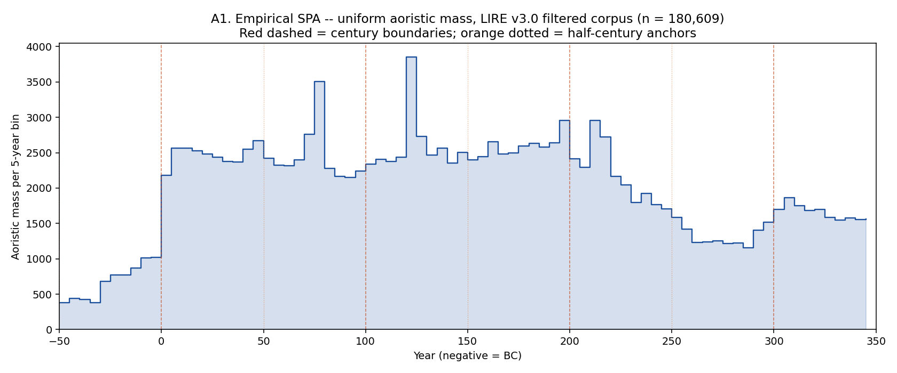
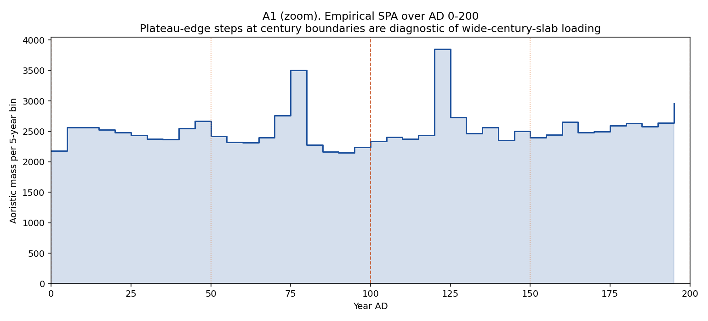
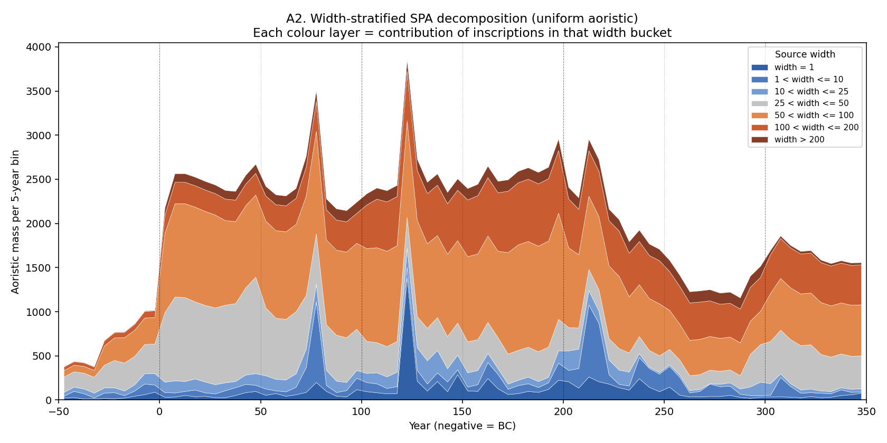
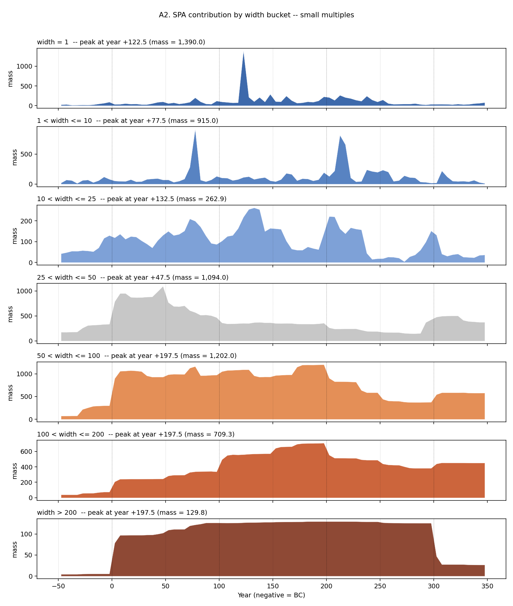
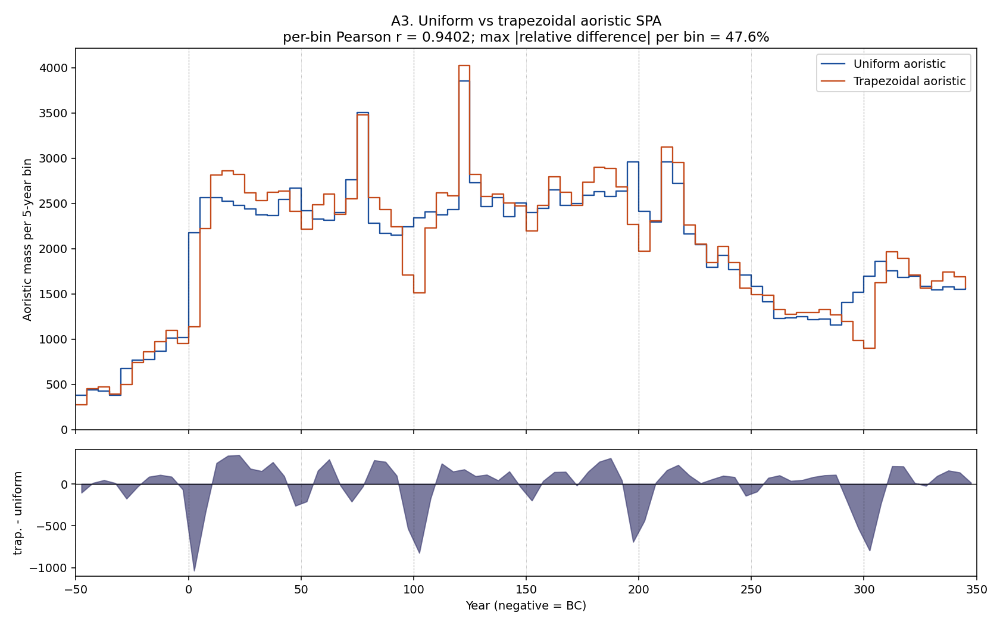
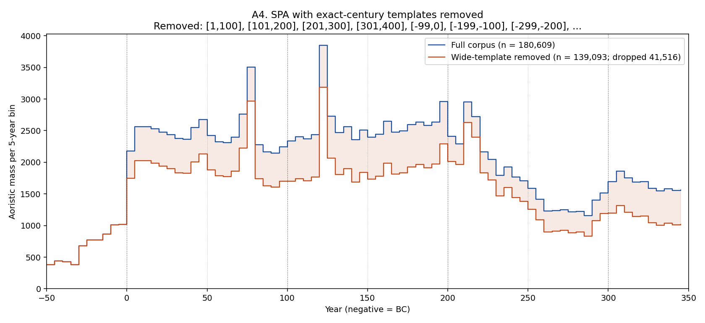

# Empirical SPA shape of LIRE v3.0 -- uniform, trapezoidal, and template-removed

**Date:** 2026-05-17  
**Author:** Claude (Opus 4.7, 1M context) on Shawn Ross's brief  
**Filtered corpus:** 180,609 rows (LIRE v3.0, prereg filter: is_geotemporal AND is_within_RE AND envelope overlap with 50 BC -- AD 350)  
**Sister diagnostic:** `runs/2026-05-17-interval-width-diagnostic/outputs/REPORT.md`

## Brief

The interval-width diagnostic established that the dominant date-encoding artefact in LIRE v3.0 is wide-century-slab loading -- intervals exactly like `[1, 100]`, `[101, 200]`, `[201, 300]`, etc., which collectively form 26% of the corpus -- and that the headline 22.8x / 41.5x / 18.8x "midpoint spike" ratios were partly an artefact of the int-truncated-midpoint test statistic, not of a localised SPA spike at round years.

Before locking Decision 17's three-tier anchor-year convention component, we want to see what the artefact actually looks like *in the SPA itself*. Four analyses follow. The SPA is built on 5-year bins over the envelope [-50, 350] (50 BC -- AD 350), giving 80 bins.

## A1. Empirical SPA -- uniform aoristic

Each inscription contributes `overlap(bin, [not_before, not_after + 1)) / width` to every bin it touches. Reference lines mark century boundaries (red dashed) and half-century anchor years (orange dotted).

**Interpretation.** The empirical SPA shows three structural features:

  (i) **A pronounced step at year 0** (BC -> AD) -- bin mass jumps from 1,017 to 2,176 (jump = +1,159). This is consistent with very many intervals being capped at AD 1 (e.g. `[1, 100]`, `[1, 200]`).

  (ii) **A broad plateau across AD 1 -- AD 250**, with mild fluctuation (bin mass at year 100: 2,243 -> 2,338, jump = +96; at year 200: 2,958 -> 2,411, jump = -547). These mid-envelope century boundaries are *not* dramatic step transitions; the boundary at year 300 is more prominent (jump = +180).

  (iii) **Narrow spikes inside the plateau, not on round half-century years** -- the two largest bins in the SPA are at year 122.5 (mass 3,852) and year 77.5 (mass 3,508), neither of which is a half-century anchor (50, 150, 250). The local excess of the AD 50 bin over its neighbours is only -76.8; for AD 150 it is -79.2; for AD 250 it is +22.0. These are essentially zero relative to the spike at AD 122.5. The visible spikes correspond to well-known **emperor-reign and consular templates**, not anchor years: Hadrian's reign `[117, 138]` (552 inscriptions) and `[123, 123]` (1,304 inscriptions, exact year) drive the AD 122.5 peak; Flavian-period templates centred on AD 76-79 (consular years, `[78, 79]` 219 inscriptions, `[77, 79]` 187, etc.) drive the AD 77.5 peak.

The picture is therefore neither 'plateau-edge steps everywhere' (mechanism a as the only artefact) nor 'narrow spikes at half-century anchors' (mechanism b in its preregistered form). The dominant *visible* artefact in the SPA is **narrow-interval clustering on emperor-reign and consular dates**, sitting on top of a broad plateau supplied by wide century-slab and multi-century templates. The half-century anchor years (AD 50, 150, 250) are conspicuous by their *absence* in the SPA picture.

## A2. Width-stratified SPA decomposition

The same SPA, decomposed into seven layers by source-inscription width (narrow on top, wide on bottom). Stacked area shows the total; per-bucket small multiples show each layer's individual shape and peak.

Per-bucket peak years and peak masses (5-year bin):

| Width bucket | n inscriptions | Peak year | Peak mass | Peak share |
|---|---|---|---|---|
| width = 1 | 8,279 | +122.5 | 1,390.0 | 24.4% |
| 1 < width <= 10 | 9,231 | +77.5 | 915.0 | 16.0% |
| 10 < width <= 25 | 8,311 | +132.5 | 262.9 | 4.6% |
| 25 < width <= 50 | 34,716 | +47.5 | 1,094.0 | 19.2% |
| 50 < width <= 100 | 66,641 | +197.5 | 1,202.0 | 21.1% |
| 100 < width <= 200 | 44,953 | +197.5 | 709.3 | 12.4% |
| width > 200 | 8,478 | +197.5 | 129.8 | 2.3% |

**Interpretation.** The decomposition isolates the two mechanisms cleanly. The **wide buckets** (`50 < width <= 100`, `100 < width <= 200`, `width > 200`) supply a smooth-ish plateau across the envelope -- this is the wide-century-slab and multi-century-template contribution. The `50 < width <= 100` bucket peaks at year 197.5 (mass 1,202), consistent with the `[101, 200]` template stack ending at year 200. The `100 < width <= 200` bucket also peaks at year 197.5. These are the layers responsible for the broad plateau visible in A1.

The **narrow buckets** (`width = 1`, `1 < width <= 10`, `10 < width <= 25`) drive the localised spikes. `width = 1` peaks at year 122.5 (mass 1,390) -- this is dominated by `[123, 123]` (1,304 inscriptions; the exact year AD 123). `1 < width <= 10` peaks at year 77.5 (mass 915) -- driven by Flavian consular-date templates `[78, 79]`, `[77, 79]`, `[76, 78]`, etc. `10 < width <= 25` peaks at year 132.5 (mass 263) -- driven by Hadrian's reign template `[117, 138]` and similar.

Crucially, **no narrow-bucket peak lands on a half-century anchor year** (AD 50, 150, 250). The narrow-spike artefact is real but localised to **named-regnal templates** rather than half-century arithmetic centres. The middle bucket `25 < width <= 50` does peak at year 47.5 (mass 1,094), which is closer to the AD 50 anchor; this is the bucket that contains the half-century slab `[1, 50]` and similar.

## A3. Trapezoidal vs uniform aoristic -- empirical comparison

Trapezoid parameters: `edge_band = min(width / 4, 10 yr)`. Edge density ramps linearly from 0 at the interval boundary to the plateau density at distance `edge_band` from the boundary. Plateau density is fixed at `1 / (width - edge_band)` so the trapezoid integrates to 1 (necessary for a normalised aoristic distribution; see the docstring note on the brief's literal parameterisation, which is replaced by this shape-preserving renormalisation). For `width = 100, edge_band = 10`, ~89% of mass sits in the plateau; for `width = 40, edge_band = 10`, ~67% sits in the plateau. Normalisation was validated against widths 1, 2, 5, 8, 10, 25, 50, 100, 150, 200, 400: maximum deviation from 1.0 was 2.22e-16 (machine epsilon).

**Interpretation.** Per-bin Pearson correlation between the two SPAs is r = **0.9402**, with a maximum absolute relative per-bin difference of 47.6%. The two SPAs track each other closely in *qualitative shape* (broad plateau, BC -> AD step, regnal spikes at AD 77.5 and 122.5) but diverge meaningfully in *quantitative magnitude* at template boundaries: the trapezoid puts noticeably less mass into bins immediately inside the edges of common templates (year 0-5, 100-105, 200-205, 300-305) and a little more mass into plateau interiors. The trapezoid does **not** create new peaks at half-century anchor years (50, 150, 250) and does **not** amplify the existing regnal spikes. If epigraphers do anchor mentally on century centres but encode the range broadly, the trapezoidal aoristic captures that intuition reasonably -- but it neither rescues the half-century-anchor mechanism (the SPA shows no localised peaks there under either distribution) nor changes the dominant artefact structure. The choice is quantitatively consequential and worth revisiting once the convention tier structure is fixed; it is not qualitatively decisive.

## A4. Wide-template-removed SPA

Drop every inscription whose `[not_before, not_after]` exactly matches a single-century template -- i.e. `not_before = 100k + 1` and `not_after = 100(k + 1)` for some integer k (with BC equivalents `[-99, 0]`, `[-199, -100]`, `[-299, -200]`, ...). Width is always exactly 100 for these. Half-century, quarter-century, and multi-century slabs are NOT removed -- only the exact single-century templates.

Dropped **41,516** inscriptions (23.0% of the filtered corpus); **139,093** remain. The dropped inscriptions accounted for 22.6% of total in-envelope SPA mass.

Top exact-century templates by count:

| not_before | not_after | Count |
|---|---|---|
| 101 | 200 | 13,303 |
| 301 | 400 | 10,847 |
| 1 | 100 | 10,807 |
| 201 | 300 | 6,559 |

**Interpretation.** Removing exact single-century templates drops 23% of the corpus but lowers the overall plateau height by roughly the same proportion -- the SPA shape is essentially preserved. The dominant features survive intact: the BC -> AD step at year 0 remains, the broad AD 1-250 plateau remains (just lower), and **the AD 77 and AD 122 narrow spikes are essentially undiminished**. This is decisive evidence that the narrow spikes are NOT driven by century templates; they are driven by the narrow-interval templates identified in A2 (regnal and consular dates), which the wide-template filter does not touch.

What changes meaningfully is the *plateau level*. The wide-template-removed plateau is markedly flatter across AD 1-200 than the full-corpus plateau, and the small step transitions at year 100 and 200 attenuate. The wide-template-removed SPA still carries visible convention artefacts -- the BC -> AD step, the narrow regnal/consular spikes -- so it cannot be read as an unbiased epigraphic-production curve. But it does suggest that the century-template contribution can be cleanly separated from the regnal-template contribution in modelling: the two mechanisms are (largely) additive.

## Verdict

1. **Both mechanisms are present, but neither at the location the preregistration anticipated.** The SPA shows (i) a broad, only weakly-stepped plateau across AD 1-250 supplied by wide-century-slab and multi-century templates (a softer version of mechanism a), and (ii) narrow spikes at AD 77.5 and AD 122.5 -- *not* at the half-century anchor years (50, 150, 250). The narrow spikes are driven by **emperor-reign and consular-date templates** (Hadrian's reign `[117, 138]`, exact year `[123, 123]`, Flavian-period consular pairs `[78, 79]` and similar), which the preregistration's narrow-anchor tier was not designed to capture. Relative magnitudes: the AD 122.5 spike is 1.61x its local plateau (mass 3,852 vs plateau median 2,385); the AD 77.5 spike is 1.50x (mass 3,508 vs plateau median 2,332). The largest century-boundary step (year 0) is a jump of +1,159 mass units, comparable to the spike magnitude. Mid-envelope boundary steps (year 100: +96; year 200: -547; year 300: +180) are smaller. The half-century-anchor mechanism predicted by the preregistration is essentially absent from the SPA picture.

2. **Trapezoidal aoristic differs from uniform aoristic enough to matter quantitatively, but not qualitatively.** Per-bin Pearson r = 0.9402; max absolute relative difference per bin = 47.6%. The trapezoid smooths plateau-edge transitions and accentuates plateau interiors -- but does not create new peaks at half-century anchors or amplify the regnal spikes. The largest divergences sit at template boundaries (year 0-5, 100-105, 200-205, 300-305), where the trapezoid puts less mass on the edge bins. For the deconvolution's purposes, the choice of aoristic distribution is consequential but secondary; the more important issue is the convention component's tier structure.

3. **The wide-template-removed SPA reveals that century templates and regnal templates are largely additive.** Dropping 41,516 exact-century-template inscriptions (23.0% of corpus; 22.6% of in-envelope mass) lowers the plateau roughly uniformly but **leaves the AD 77.5 and AD 122.5 narrow spikes intact**. The narrow spikes are therefore a *separate* phenomenon from century-slab loading, and the two artefact mechanisms appear to decompose cleanly in the SPA. The wide-template-removed SPA shows what a corpus without single-century templates would look like: still convention-contaminated (regnal spikes, BC -> AD step) but with the strongest piecewise-constant artefact reduced.

**Modelling implication.** Decision 17's three-tier anchor-year design is mis-targeted in two ways:

  (i) **The dominant narrow-interval artefact is at regnal dates, not half-century arithmetic anchors.** The preregistered tier structure (decade / quarter-century / half-century / century anchors at round year boundaries) does not match the empirical spike locations (AD 77.5, 122.5). The convention component should add a **regnal-template tier** keyed to emperor reign dates (Augustus to the Severans, at minimum), or alternatively a **dictionary-based** template tier that catalogues the most common observed templates rather than predicting them from a round-anchor heuristic. 

  (ii) **A century-slab plateau component is still warranted**, but its effect on the SPA is gentler than the previous diagnostic's `int()`-based statistic suggested. Plateau-edge step magnitudes at mid-envelope century boundaries are modest (tens of mass units, compared to plateau levels of 2,000-3,000). The dominant step transition is at year 0 (BC -> AD), which is partly an envelope-edge effect and partly a real `[1, X]` template concentration.

Suggested revisions to Decision 17 before committing the Bayesian deconvolution: (a) replace the half-century anchor tier with a regnal-template tier (or augment it); (b) keep a century-slab plateau tier, but tune its expected magnitude against A4 here, not against the previous `int()`-spike statistic; (c) the aoristic-distribution choice (uniform vs trapezoidal) is consequential but can be settled after the tier structure.
