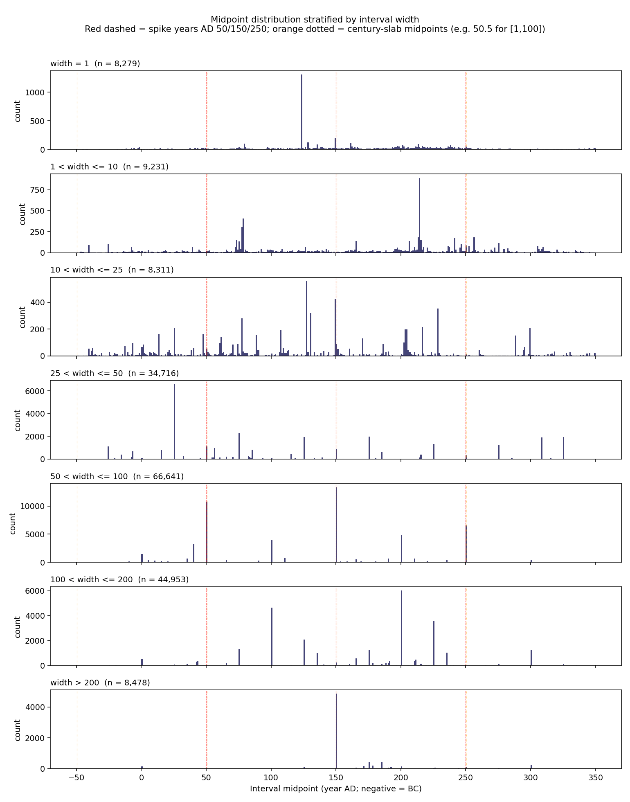
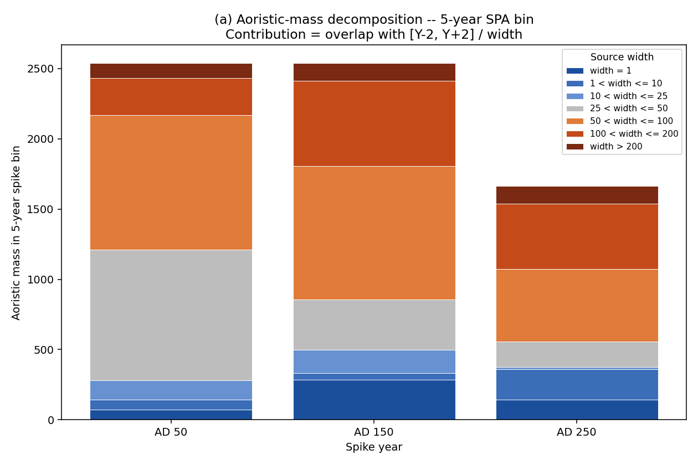
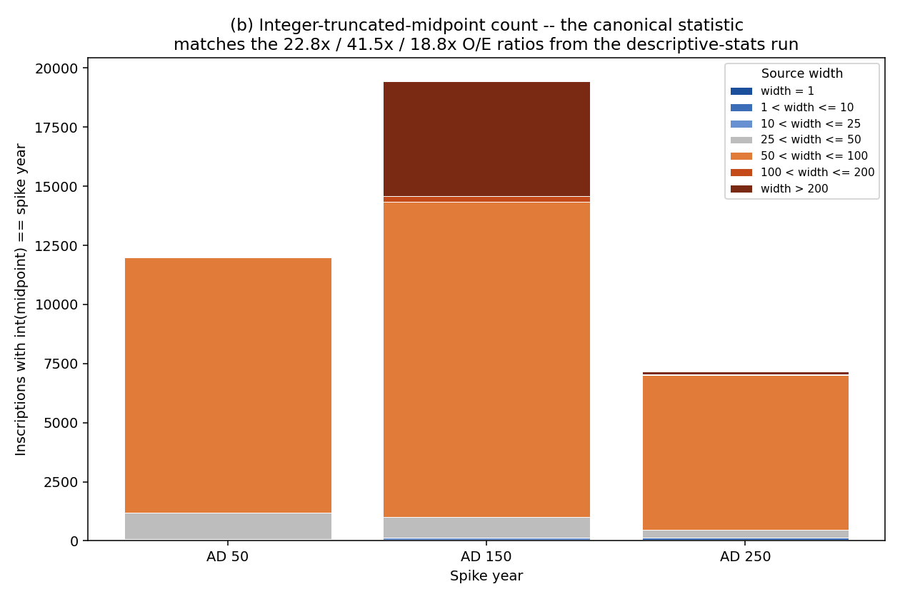
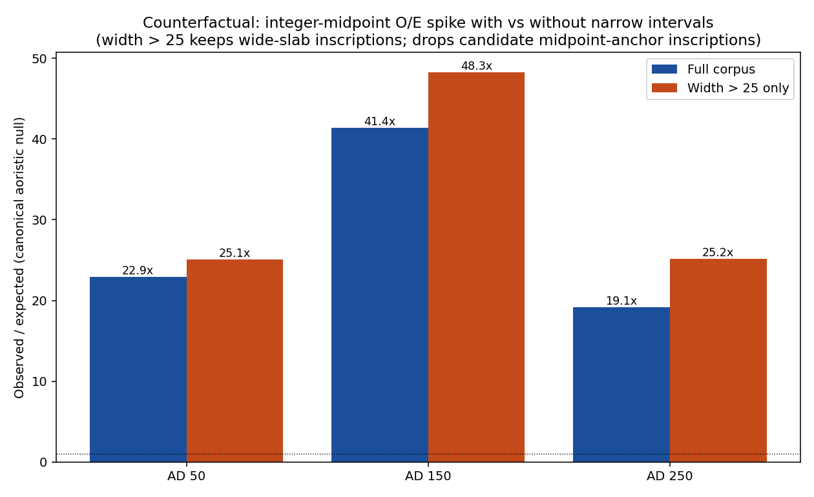

# Interval-width diagnostic for LIRE v3.0 SPA spikes

**Date:** 2026-05-17  
**Author:** Claude (Opus 4.7) on Shawn Ross's brief  
**Filtered corpus:** 180,609 rows (LIRE v3.0, prereg filter: is_geotemporal AND is_within_RE AND envelope overlap with 50 BC -- AD 350)

## Brief and interpretive correction

The descriptive-stats run reports observed/expected ratios of 22.8x, 41.5x, 18.8x at AD 50, 150, 250 (plus 39.7x at AD 350) under an aoristic-probability null with Westfall-Young adjustment. The preregistration currently explains these as 'intervals like [1, 100] place aoristic mass on midpoint years' -- which is incorrect *if* one assumes the spike statistic is the per-year aoristic mass (under uniform aoristic, [1, 100] deposits flat mass across AD 1-100).

However, on re-reading `runs/2026-04-23-descriptive-stats/code/profile.py` (function `run_aoristic_mc_test`, endpoint_label `mid`, line 670), the headline ratios were generated by a *different* statistic: the count of inscriptions whose **integer-truncated midpoint** `int((nb + na) / 2)` equals the spike year. Under that statistic, a wide century slab like `[1, 100]` *does* contribute to the count at AD 50, because `int(50.5) == 50`. Similarly `[101, 200]` and `[201, 300]` contribute to AD 150 and AD 250 respectively. So the 22.8x spike confounds two mechanisms:

  (a) **Wide-century-slab loading** -- intervals exactly like [1, 100], [101, 200], [201, 300] whose midpoints happen to truncate to round years; 
  (b) **Narrow midpoint-anchored intervals** -- intervals like [49, 51] or [45, 55] whose centres genuinely fall on round years.

The Bayesian mixture's three-tier anchor component handles mechanism (b). It does not handle mechanism (a). This diagnostic disentangles the two by stratifying the spike contribution by source-inscription width.

## Q1. Interval-width distribution

Percentiles of `width = not_after - not_before + 1`:

| Percentile | Width (yr) |
|------------|------------|
| 5th       | 2.0        |
| 10th       | 12.0        |
| 25th       | 50.0        |
| 50th       | 100.0        |
| 75th       | 150.0        |
| 90th       | 200.0        |
| 95th       | 200.0        |

Modal-width concentration (fraction of corpus at exact width):

| Width | Count | Share |
|-------|-------|-------|
| 1 | 8,279 | 4.58% |
| 5 | 797 | 0.44% |
| 10 | 603 | 0.33% |
| 25 | 854 | 0.47% |
| 50 | 20,286 | 11.23% |
| 100 | 47,487 | 26.29% |
| 200 | 28,007 | 15.51% |

## Q2. Width x midpoint cross-tabulation

Stratified midpoint histograms reveal whether narrow intervals (width <= 25) preferentially cluster on the round-century years (AD 50, 150, 250) or are scattered. They also show whether wide intervals concentrate on the century-slab midpoints (50.5, 150.5, 250.5 -- indicating intervals like [1, 100], [101, 200], [201, 300]).

## Q3. Spike decomposition by source-inscription width

Two parallel decompositions, because two different statistics are in play.

### Q3(a) -- 5-year SPA-bin aoristic mass

For each 5-year spike bin (AD 50 = [48, 52], AD 150 = [148, 152], AD 250 = [248, 252]), aoristic mass is `overlap / width` per inscription. Under this statistic [1, 100] contributes 5/100 = 0.05 to the AD 50 bin, and a narrow [49, 51] contributes 3/3 = 1.0. The shares below show the fraction of bin mass coming from each width bucket.

| Spike | width = 1 | 1 < width <= 10 | 10 < width <= 25 | 25 < width <= 50 | 50 < width <= 100 | 100 < width <= 200 | width > 200 | Total mass |
|---|---|---|---|---|---|---|---|---|
| AD 50 | 2.9% | 2.8% | 5.4% | 36.7% | 37.7% | 10.4% | 4.2% | 2,538.4 |
| AD 150 | 11.2% | 1.8% | 6.5% | 14.1% | 37.4% | 23.9% | 5.1% | 2,539.6 |
| AD 250 | 8.6% | 13.0% | 1.0% | 10.9% | 31.0% | 27.9% | 7.7% | 1,665.2 |

### Q3(b) -- Integer-truncated-midpoint count (canonical)

This reproduces the statistic that generated the headline 22.8x / 41.5x / 18.8x ratios in `runs/2026-04-23-descriptive-stats/outputs/artefacts.md`. For each inscription, contribution = 1 if `int((nb + na) / 2) == spike` else 0. Wide century slabs `[1, 100]`, `[101, 200]`, `[201, 300]` contribute *fully* to AD 50 / 150 / 250 respectively (their midpoints truncate to round years).

| Spike | width = 1 | 1 < width <= 10 | 10 < width <= 25 | 25 < width <= 50 | 50 < width <= 100 | 100 < width <= 200 | width > 200 | Total count |
|---|---|---|---|---|---|---|---|---|
| AD 50 | 0.1% | 0.2% | 0.4% | 9.1% | 90.0% | 0.0% | 0.1% | 12,008 |
| AD 150 | 0.1% | 0.1% | 0.5% | 4.5% | 68.6% | 1.3% | 25.0% | 19,451 |
| AD 250 | 0.7% | 1.2% | 0.2% | 4.3% | 91.5% | 0.6% | 1.6% | 7,170 |

## Q4. Counterfactual: remove narrow intervals and re-measure

Drop all inscriptions with `width <= 25` and recompute the canonical integer-truncated-midpoint O/E. The 'full corpus' column should approximately reproduce the 22.8x / 41.5x / 18.8x headline numbers. If the wide-only column collapses, mechanism (b) dominates; if it stays high, mechanism (a) dominates.

| Spike | Full-corpus O/E | Wide-only O/E (width > 25) | Retained fraction | Wide-only observed |
|-------|-----------------|-----------------------------|-------------------|--------------------|
| AD 50 | 22.90x | 25.07x | 109.5% | 11,925 |
| AD 150 | 41.39x | 48.29x | 116.7% | 19,324 |
| AD 250 | 19.14x | 25.18x | 131.6% | 7,024 |

## Verdict

**Mechanism (a) -- wide-century-slab loading -- dominates.** The convention component needs an additional century-slab layer.

Under the canonical integer-truncated-midpoint statistic, narrow intervals (width <= 25) supply on average 1% of the spike count and wide intervals (width > 50) supply 93%, averaged across the three spike bins (AD 50, 150, 250).

Dropping all width <= 25 inscriptions changes per-spike O/E as: AD 50: 22.9x -> 25.1x (109% retained); AD 150: 41.4x -> 48.3x (117% retained); AD 250: 19.1x -> 25.2x (132% retained). Average retained O/E magnitude across the three spikes: 119%.

**Modelling implication.** Wide intervals account for the majority of the inscriptions whose integer-truncated midpoint falls at AD 50 / 150 / 250 -- and they survive a `width > 25` cut. The reason is straightforward: thousands of inscriptions are encoded as the exact century templates `[1, 100]`, `[101, 200]`, `[201, 300]`, whose midpoints are 50.5, 150.5, 250.5 -- all truncating to round years under `int()`. The narrow midpoint-anchor tier alone cannot reproduce this signature.

Two structural changes therefore look warranted for the convention component:

  1. **Add a century-slab layer** (mechanism a). Wide intervals exactly matching `[1, 100]`, `[101, 200]`, `[201, 300]`, `[301, 400]` (and `[-99, 0]`, `[-199, -100]`) deposit a flat plateau of mass over their century. The mixture should include a component that places mass *uniformly over the century slab*, weighted by the empirical share of exact-100-year intervals.

  2. **Re-examine the spike statistic itself.** The 22.8x / 41.5x / 18.8x ratios are an artefact of the `int()`-truncation in the test, not of an underlying SPA-mass spike at the round years. Under the 5-year aoristic-mass statistic (Q3a), wide slabs deposit flat mass; the *visual* SPA curve has plateau edges, not spikes. The preregistration's narrative around 'midpoint spikes' may need rewording to distinguish: (i) plateau-edge step artefacts from century slabs, (ii) genuine narrow-anchor spikes at round years.
