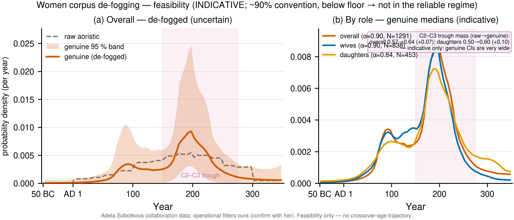
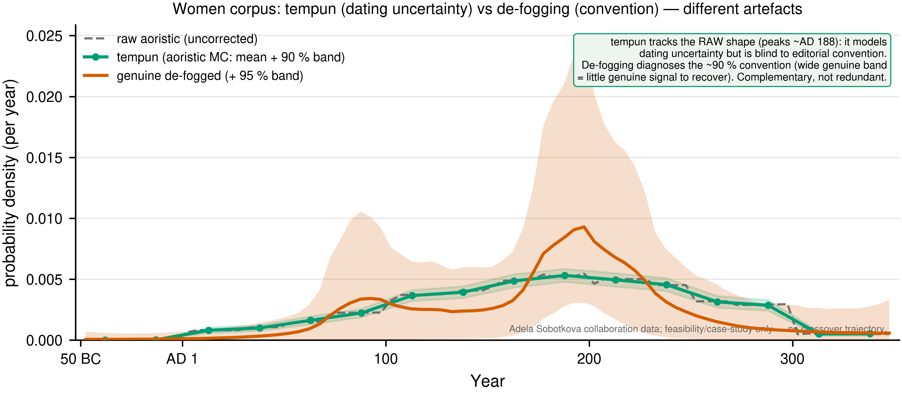

# Memo — convention de-fogging of the wives/daughters corpus (feasibility)

**To:** Adela Sobotkova (co-author) · **From:** Shawn Ross (with Claude Code) ·
**Date:** 2026-06-21 · **Re:** "From Graveyard to Time Series" — can our
editorial-convention de-fogging sharpen the *timing* of your datable conjugal
corpus? · **Status:** Stage-1 feasibility; methodological only.

> **Scope (agreed):** this is a *feasibility* check — genuine-vs-raw temporal
> de-fogging and a reachability verdict. It does **not** compute the
> wife-vs-daughter crossover-age trajectory; that substantive result is reserved
> for the companion (EJA) paper. Operational `datable`/`conjugal` filters are
> ours and need your confirmation before any number is quoted (see §4).

## The short answer

**De-fogging cannot reliably sharpen the time-resolution of this corpus as it
stands.** The datable conjugal corpus is **~90 % editorial-convention dated** and
sits **below / at the reliability floor** of the method. So the *timing* of the
crossover trough cannot be put on firmer ground by convention-correction here —
which is itself useful to know: it tells us the trough's timing rests on a
temporal distribution that is mostly editorial artefact, and the honest move is to
hedge the timing claim accordingly rather than over-read it.

## The numbers (canonical `data/women.csv`, 504 daughters)

Datable conjugal corpus: **1,291** inscriptions (838 wives, 453 daughters), fitted
with our production cross-classified deconvolution (same model as the JAMT paper's
29 units). "α" below is the **convention fraction** — the share of apparent dating
that is editorial round-number convention, not a real date signal (so 1 − α is
genuine).

| subset | N | convention fraction α | 95 % CI | reachability |
|---|---|---|---|---|
| overall | 1,291 | **0.90** | [0.81, 0.99] | marginal on N; α far above envelope |
| wives | 838 | 0.90 | [0.80, 1.00] | marginal on N |
| daughters | 453 | 0.84 | [0.75, 0.98] | **below the 500 floor** |

All three fits converged cleanly (R̂ ≈ 1.003, ESS ≈ 1 000–1 500, 0 divergences).

## Why "not reliable" (two independent reasons)

1. **Too convention-dominated.** Our method has a validated operating envelope of
   **convention fraction α ≤ ~0.70**; above that the genuine component is too
   weakly constrained to trust. Your corpus is α ≈ 0.84–0.90 — well outside it.
2. **Too small for the hard regime.** The reachability floor is N ≈ 500 for *easy*
   (low-α) subsets, rising to **N ≈ 2,000 for hard (high-α) ones**. Your corpus is
   high-α, so the worst-case floor applies: overall (1,291) and wives (838) are
   *marginal*; daughters (453) is *below even the easy floor*.

The de-fogged genuine SPD (Figure `fig-women-genuine-vs-raw`) shows this directly:
the 95 % band is very wide — the genuine temporal shape is highly uncertain.

## What this means for the crossover paper

- The **crossover trough's timing** (your C2–C3 inflection, ~AD 150–275) is read
  off a temporal distribution that is ~90 % editorial convention. De-fogging can't
  rescue the time-resolution, so the timing claim should be **hedged** (it may be
  robust to convention for other reasons — e.g. if the trough is driven by the
  *ages*, which `tempun` handles, rather than the *dating* — but convention
  de-fogging does not add confidence to the *when*).
- This does **not** undermine the substantive crossover-age result (the *ages* and
  their Monte-Carlo treatment are your `tempun` pipeline's domain, which we are not
  touching). It is specifically a statement about the **datability/timing** axis.
- A larger or more tightly-dated subset (e.g. inscriptions with narrower intervals,
  or a securely-dated sub-corpus) could move into the reliable envelope — worth
  exploring if the timing claim is load-bearing.

## Is there a better-dated subset that escapes the problem? (No)

The obvious next question: could we restrict to the *well-dated* inscriptions —
the narrow date intervals — and de-fog *those* reliably? We checked (fitting the
corpus restricted to date-range width ≤ 50/75/100/150 years). **No subset
escapes:** every one stays above the reliable envelope (α from 0.74 to 0.97), and
the genuinely-precise core is tiny (N = 6 at width ≤ 4y). The reason is
structural — the editorial convention in this corpus *is* round-number dating:
68 % of records use round 25-year slabs, and the narrowest "tidy" intervals (the
round half-centuries, AD 100–150 etc.) are the *most* convention-laden of all
(width ≤ 50y is 97 % convention). So there is no well-dated core large enough to
carry a reliable temporal read — the limitation is intrinsic to how this kind of
corpus is dated, not a matter of sample size we could filter our way around.

## An indicative read (heavily caveated — *not* a result)

Despite the corpus being outside the reliable regime, the fit is worth showing as
*suggestive*. In the C2–C3 trough window (~AD 150–275, where your crossover
inflection sits), de-fogging **shifts temporal mass *into* the window**, not out
of it:

| subset | raw trough mass | genuine (de-fogged) | shift |
|---|---|---|---|
| overall | 0.57 | 0.64 [0.46, 0.91] | **+0.07** |
| wives | 0.61 | 0.62 [0.17, 0.90] | +0.01 |
| daughters | 0.50 | 0.60 [0.35, 0.88] | **+0.10** |

So convention-correction *tentatively* concentrates **more** genuine activity in
the trough window than the raw curve implies — i.e. the apparent "thinness" of the
record there may be partly an editorial-convention artefact. **But the genuine
credible intervals are very wide** (e.g. daughters [0.35, 0.88]) and span the raw
value, so this is **indicative only — read it as a hypothesis to test on a
better-dated subset, not a finding.** (Figure `fig-women-genuine-vs-raw`, panel b
shows the per-role genuine medians; both roles peak ~AD 190 and decline through the
window.) The point for the crossover paper: de-fogging does not *erase* the trough
window's signal — if anything it firms it up — but the uncertainty here is too
large to lean on.

## The figures

The de-fogged temporal distribution (with the verdict), and the per-role genuine
medians — note the wide uncertainty band, which *is* the message:

## De-fogging vs `tempun` (they correct different things)

Your `tempun` pipeline models *aoristic dating uncertainty*; our deconvolution
removes *editorial convention*. They are complementary, not redundant. We ran
`tempun` over the corpus ourselves: its curve tracks the raw (convention-laden)
shape — both peak ~AD 188 — because `tempun` adds uncertainty bands but does not
remove the round-slab convention. Our de-fogged curve is different. So `tempun`
would report the AD-188 peak as if genuine; the de-fogging is what reveals it is
mostly editorial. (If you share your own `tempun` output we can confirm ours
matches.)

## §4 — confirm before we quote any figure to anyone

- Our operational **`conjugal`** = role ∈ {wife, daughter} ∧ type = familial (the
  whole file); **`datable`** = valid `not_before`/`not_after` overlapping 50 BC –
  AD 350. Do these match your definitions? Any `link_status` / `confidence` gate?
- Your analysis window (we used the model's −50 … 350; your interest is ~50–349 CE).
- If you can share your `tempun` SPA output, we can overlay genuine-vs-raw-vs-tempun.

*Reproduce:* `runs/2026-06-20-women-corpus-feasibility/` (driver
`code/run_women_feasibility.py`, figure `code/fig_women_genuine_vs_raw.py`).
Collaboration data — not for publication without Adela's involvement.
